# My notes on DSA

I'm making my detailed notes here as I'm learning DSA.
This can be useful to you even if you don't have any knowledge of DSA.

If you find something that I have written wrong or It could be explained in a better
way please submit an issue [here](https://github.com/siddharthroy12/My-DSA-Notes/issues).

Contributions are welcomed.

## Table of Contents

1. [Big O](#big-o)
    1. [How to calculate Big O](#how-to-calculate-big-o)
    2. [Space Complexity](#space-complexity)
    3. [Big O Cheat Sheet](#cheat-sheet)
2. [Data Structures](#data-structures)
    1. [Operations on Data Structures](#operations-on-data-structures)
    2. [Arrays](#array)
    3. [Hash Tables](#hash-tables)
    4. [Linked List](#linked-list)
    5. [Stacks and Queues](#stacks-and-queues)
    6. [Trees](#trees)
    7. [Graphs](#graphs)
3. [Algorithms](#algorithms)
    1. [Recursion](#recursion)
    2. [Back Tracking](#backtracking)
    3. [Two Pointers](#two-pointers)
    4. [Divide and Conquer](#divide-and-conquer)
    5. [Sorting](#sorting)
    6. [Searching](#searching)
    7. [BFS and DFS](#bfs-and-dfs)
    8. [Dynamic Programming](#dynamic-programming)
6. [Additional Important Topics](#additional-important-topics)
6. [Coding Problems](#coding-problems)

## Big O

The Big O notation is used to show how well an algorithm scales
in terms of speed and space as the input grows.

It indicates how much time and memory an algorithm
will take to solve a problem for a given input.

Because a code can run faster or slower on different processors
calculating time not a good way to calculate the efficiency of a program.

That's why we use Big O notation to show how well a code performs
when the input grows.

Big O can also be plotted on a graph:

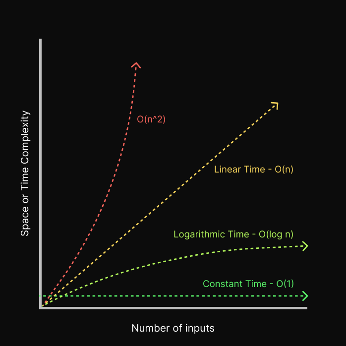

Note that even though O(n^2), O(2^n) and O(n!) are marked as horrible it's not always the case.

In some cases you cannot avoid having steep time complexities,
they can be the most efficient complexities for certain problems so keep that in mind.

### How to caculate Big O

To calculate Big O we need to calculate how many operations
the code/function/program will take for the given input.

For example this code:

```js
function getFirstElement(array) {
    return array[0];    // -- O(1)
}
```

This code returns the first element of an array
so it has only one operation so the Big O of this function is O(1).

Let's look at another example:

```js
function sumOfFirstTheeElements(array) {
    let res = 0;    //  -- O(1)

    for (let i = 0; i < 3; i++) {   // -- O(3)
        res += array[i];
    }

    return res;   // -- O(1)
}
```

You might think the Big O of this function is O(5) because
there are five operations in this code.

This is correct but as the input grows the number of operations
stays the same, it does not grow.

So it's a linear time which when denoted as O(1).

Let's look at a code where the numeber of operations grows as the input:

```js
function getIndexOf(array, element) {
    for (let i = 0; i < array.length; i++) { // -- O(n)
        if (array[i] === element) {
            return i;
        }
    }
}
```

This code will find the index of an element in an array by looping over each element.

So in the best case if the element is at the first index
it will only do one operation O(1) but in the worst case,
the number of operations will be equal to the number of inputs
which is denoted by O(n).

When we calculate the Big O we always take the worst case
so the Big O of this code is O(n).

Let's look at another similar example:

```js
function getIndexOfArrayAndSumOfFirstThree(array, element) {
    let index = 0;
    let sum = 0;

    for (let i = 0; i < array.length; i++) { // -- O(n)
        if (array[i] === element) {
            index = i;
            break;
        }
    }

    for (let i = 0; i < 3; i++) {   // -- O(3)
        sum += array[i];
    }

    return { index, sum };
}
```

Here we have a function that does two things:
    - Get the index of an element
    - Get the sum of the first three elements

You might think that the Big O of this function is O(n) + O(3) = O(n+3).
But we don't count the constant numbers like 3 because if the number of elements
is 1000 then having an extra 3 operation doesn't matter to us,
so we remove the constant and this becomes O(n).

> In big tech we often work with big amount of data

But what if we have two for loops?

```js
function getSumAndMultipleOfElements(array) {
    let sum = 0;
    let multiple = 0;

    for (let i = 0; i < array.length; i++) {   // -- O(N)
        sum += array[i];
    }

    for (let i = 0; i < array.length; i++) {   // -- O(N)
        multiple *= array[i];
    }

    return { sum, multiple };
}
```

We have to O(n) here so it should become O(2n) right?

Even though the graph of this is steeper than O(n)
it's still a straight line (a linear graph),
so once again we remove the constant and it becomes O(n).

For two separate collections:

```js
function getSumOfTwoArray(array1, array2) {
    let sum1 = 0;
    let sum2 = 0;

    for (let i = 0; i < array.length; i++) {   // -- O(N)
        sum1 += array1[i];
    }

    for (let i = 0; i < array.length; i++) {   // -- O(N)
        sum2 += array2[i];
    }

    return { sum1, sum 2};
}
```

People often confuse this as O(n) but this is incorrect.
Because we have two inputs we need to show two variables in the notation.
So this is O(a+b).

For nested loops:

```js
function getPairsOfElements(array) {
    let res = [];

    for (let i = 0; i < array.length; i++) {   // -- O(N)
        for (let j = 0; j < array.length; j++) {   // -- O(N)
            res.push([i,j]);
        }
    }

    return res;
}
```

For nested loops like this, we just multiply the operations,
so this becomes O(n * n) = O(n^2).

And the last rule:
Drop Non-dominant terms

```js
function getSumAndPairs(array) {
    let pairs = [];
    let sum = 0;

    for (let i = 0; i < array.length; i++) {   // -- O(N)
        for (let j = 0; j < array.length; j++) {   // -- O(N)
            pairs.push([i,j]);
        }
    }

    for (let i = 0; i < array.length; i++) {   // -- O(N)
        sum += array1[i];
    }
}
```

This looks like it has the complexity of O(n + n^2) but
because n^2 is way more important than n because it grows much faster than n.

When we calculate Big O we are concerned about the scalability of the function
and not the accurate speed of the function.

### Space complexity

Big O is not only used to calculate time compexity
it also used to calculate memory usage.

And there is relation between time and memory usage in computers.

If an algorithm uses less time then It will have to use more memory,
If an algorithm uses less memory then it will take more time to perform.

You cannot have the best of both worlds.

If you are writing a software that runs on low-end systems (like mico conrollers)
you wanna sacrifice speed for low memory usage.

And If you are writing a software that runs on a high-end system with lots of
data to process you wanna sacrifice memory usage for speed.

Let's look at an example to learn how to calculate space complexity:

```js
function sumOfFirstTheeElements(array) {
    let res = 0;    //  -- O(1)

    for (let i = 0; i < 3; i++) {   // -- O(1)
        res += array[i];
    }

    return res;
}
```

When we calculate space complexity we do not include the space occupied by the inputs.

Inside our function, we are only creating two variables and
it does not grow as the input grows so it's constant O(1).

Let's look at another example:

```js
function generateHelloArray(n) {
    let res = [];

    for (let i = 0; i < n; i++) {
        res.push("Hello");
    }

    return res;
}
```

The input n can also be an integer, not just an array.

Here we are creating an array inside the function and the length of the array
is the same as n so the space complexity of this is O(n).

### Cheat sheet

#### The most common Big Os

**O(1)** Constant - no loops

**O(log N)** Logarithmic - usually searching algorithms have log n
if they are sorted (Binary Search)

**O(n)** Linear - for loops, while loops through n items

**O(n log(n))** Log Linear - usually sorting operations

**O(n^2)** Quadratic - every element in a collection needs to be compared
to ever other element. Two nested loops

**O(2^n)** Exponential - recursive algorithms that solves a problem of size N

**O(n!)** Factorial - you are adding a loop for every element

#### Rules

- Always worst case
- Remove constants
  - O(n*2) => O(n)
  - O(n+100) => O(n)
  - O(n/2) => O(n)
- Different variables for different inputs
  - O(a + b)
  - O(a * b)
- Use + sign for loops in order
- Use * for nested loops
- Iterating through half a collection is still O(n)
- Drop Non-dominant terms
  - O(n + n^2) => O(n^2)

#### What Causes Time Complexity?

- Operations (+, -, *, /)
- Comparisons (<, >, ==)
- Looping (for, while)
- Outside Function call (function())

#### What Causes Space Complexity?

- Variables
- Data Structures
- Function Call
- Allocations

## Data Structures

To write an efficient software it's important to learn how to use these different
types of data structures and how they can improve the efficiency of your program.

### Operations on Data Structures

Data structures are simply ways to organise data on our computers and
each data structures have their tradeoffs, some are good at certain operations
and other are good at other operations.

The operations we are talking about are:

- Insertion: Adding more data
- Deletion: Deleting a data
- Traversal: Looping through all the data
- Searching: Searching for a data
- Sorting: Sorting all the data
- Access: Accessing a data

Here is a cheat sheet on operations for all data structures:
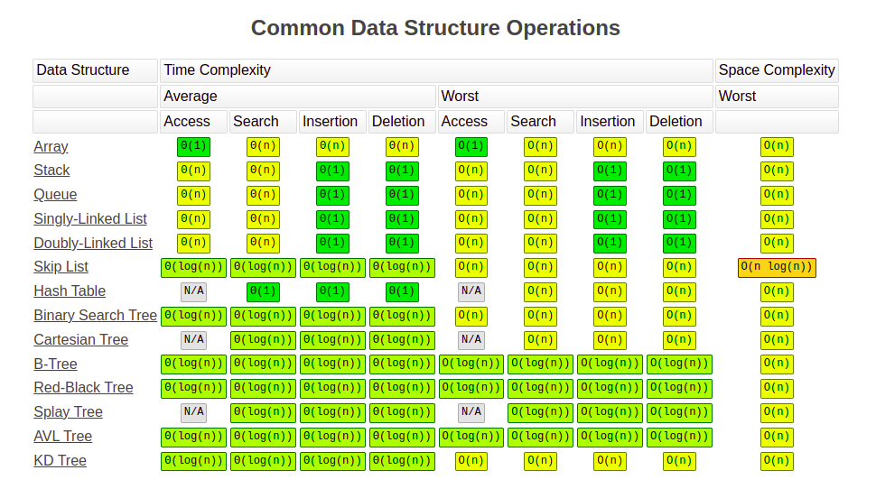

### Array

The most basic and commonly used data structure.
Elements of an array are placed next to each other in memory,
mapped with numbers starting at 0.

Elements of an array are stored sequentially, meaning if we have the address
of the first element of an array to access the second element all we need
to do is add one to the address and to access the second element add two, and so on.

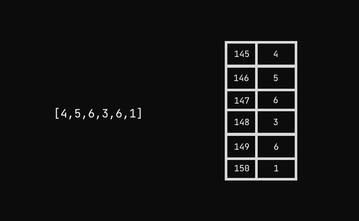

This makes the access time O(1) if we know the index of our data.
But if you want to search for a data you need to loop over every element
one by one which makes the searching time O(n).

To calculate the length of the array we don't need to loop over the entire array,
we can just store the length of the array inside a variable/property
when we create the array (like in JS `array.length`) and increase/decrease this value
whenever we add or remove an element in the array.

And most languages provide this length property
so the access time of the last element of the array is also O(1).

But adding and removing an element is a different story.

Many languages provide two methods for array `push` and `pop` to insert
and remove an element at the end of the array.

`push` and `pop` have O(1) time complexity.

But if you want to add or remove an element anywhere else in the array
the elements after the index you just changed will have to re-order so in
the worst-case scenario the time complexity of inserting
and removing an element is O(n)

And strings are also an array of characters so the same applies to strings too.

#### Operations On Arrays

**Inserting** O(1) at the end and O(n) at the beginning.

**Deleting** Same as Inserting.

**Lookup** O(1).

**Searching** O(n).

#### Coding Problems

##### Reversing an array

Most programming languages provide a built-in method for reversing an array
but let's look at the ways we can implement this.

First, the most simple way to reverse an array:

```js
function reverse(input) {
    const output = [];

    for (let i = input.length-1; i >= 0; i--) {
        output.push(input[i]);
    }

    return output;
}
```

It loops through the array in reverse order and pushes the value into a new array.

The time and space complexity of this code is O(n), but we can improve this.

```js
function reverse(input) {
    let index1 = 0;
    let index2 = input.length-1;

    while(index2 > index1) {
        let tmp = input[index1];
        input[index1] = input[index2];
        input[index2] = tmp;
        index1++;
        index2--;
    }
}
```

In this function, we are using two indexes that point to the opposite sides
of the array and swap the values of the indexes as they move towards the center.

The above function has a space complexity of O(1) because
it creates a constant amount of space and mutates the input value instead.

This still has the time complexity of O(n) if you are confused.

Now, this function is a un-pure function because it is mutating the input value
which is not always an option so that's why
the previous solution was not that bad for reversing an array.

##### Merging sorted array

Let's solve a more complex interview question.

Q. Given two sorted arrays, merge them into one sorted array.

For example: `[0,4,6]` and `[2,3,7]` should become `[0,2,3,4,6,7]`

Answer:

To solve this problem we need to store two indexes.
[1] One will point to the first element of the first array and
the other one will point to the first element of the second array.

[2] Then compare the two values and increase the index pointing
to the shorter value and push the shorter value to the result array.

Keep doing this until one of the indexes hit the end
[3] then add the remaining elements to the result array.

```js
function mergeSortedArray(array1, array2) {
    // [1]
    let index1 = 0;
    let index2 = 0;
    let result = [];

    // [2]
    while(index1 < array1.length && index2 < array2.length) {
        if (array1[index1] < array2[index2]) {
            result.push(array1[index1]);
            index1++;
        } else {
            result.push(array2[index2]);
            index2++;
        }
    }

    // [3]
    while(index1 < array1.length) {
        result.push(array1[index1]);
        index1++;
    }
    while(index2 < array2.length) {
        result.push(array2[index2]);
        index2++;
    }

    return result;
}
```

Both the time and space complexity of this algorithm is O(a+b).

### Hash Tables

Map(C++), HashMap, Dictionary(Python), Object(JavaScript),and HashTable
are some of the ways to call this data structure and
different languages have slight variations of hash tables.

Hash tables are very important all across computer science.

Hash tables allow us to store data in a key-value pair and
this key is mostly a string or a number(we can use almost any type of data as key).

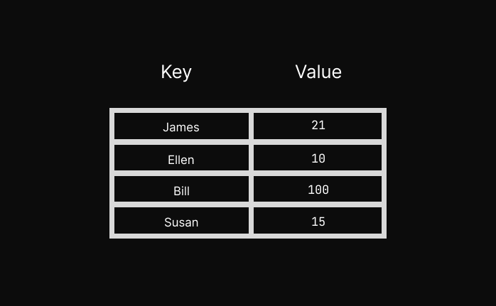

In hash tables we use key to find the value in memory,
unlike arrays in hash tables data is not stored in sequencial way
but still the access time of hash tables is O(1), it's constant.

Hash tables uses one-way hashing algorithm where the key is the input
and the output is the address in memory and this implementation
of this hashing algorithm is different in all languages.

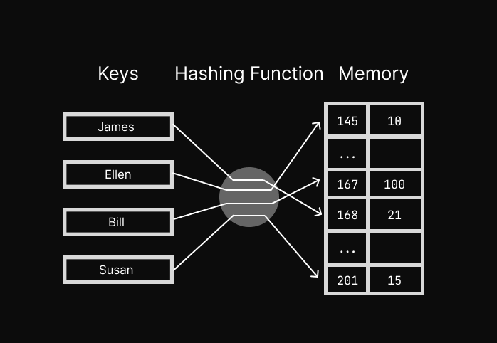

#### Hash Function

Hash Function is again something that is used all across computer science.
A Hash Function is simply a function that generates a fixed-length string
that looks like some random gibberish for any given input. The output is called Hash.

Eg. `5d41402abc4b2a76b9719d911017c592`

You can play around with a famous hash function MD5 on [this website](http://www.md5.cz/).

There are some key aspects of hash functions:

- The function is a one-way function. Meaning there is no way to know
  what the input was by looking at the output.
- For the same input the output is always going to be the same
- If the input changes even by one bit, it's going to completely change the output

In hash tables, the hash function returns a memory address for a given input.
This makes accessing a block of memory by a key O(1) time.

This is extremely useful because now we can map data to a string(name, etc)
instead of a number like in an array.

The hash function takes some time to calculate the output and it can slow down
accessing data using HashTable. That's why in most languages the HashTable
is implemented by the most efficient hash function.

#### Hash Collisions

Hash Functions are great, they can generate a unique random string for a given input
and two different inputs cannot produce the same hash.

But when we use a hash table the range of the output of the hash function becomes limited.
So sometimes two different output results in the same address in the memory.

To deal with that different implementations have different methods. One of which is
Separate Chaining which uses a linked list to solve this issue but it slows down the
access time from O(1) to O(n) where n is the size of the linked list.

This is how it looks like:

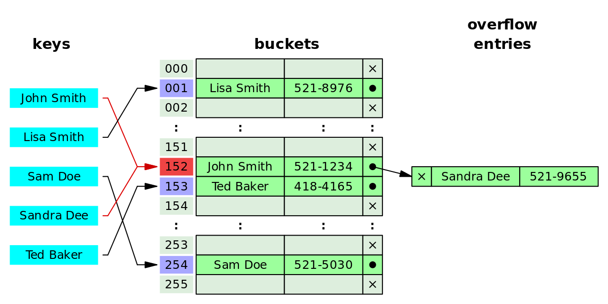

Mostly you don't have to worry about Hash Collision happening
but it's good to know that this happens.

#### Coding Problems

##### First Recurring Element

Q. For a given array find the first recurring element

Example: [2,5,1,2,3,5,1,2,3] => 2

Answer:

To solve this problem we need to loop over every element of the array
and store the seen elements somewhere so that we can check if an element has
been seen before.

We will use hash table to store seen elments.

```js
function firstRecurringElement(input) {
  let seen = {};

  for (let i = 0; i < input.length; i++) {
    // Check if key exists
    if (seen[input[i]]) {
      return input[i];
    }

    // Otherwise store the key with any value
    seen[input[i]] = true;
  }

  // If no recurring element return false
  return false;
}
```

The time and space complexity of this is O(n).

#### Operations on Hash Tables

**Inserting** O(1).

**Deleting** O(1).

**Lookup** O(1).

**Searching** O(1) if searching using key, otherwise O(n).

### Linked List

As the name suggests it's a list that's linked. The best way
to explain this is using a diagram.

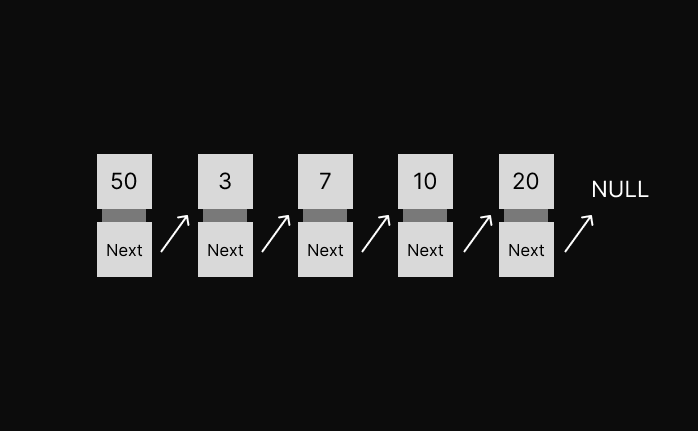

A linked list is a collection of Nodes, each Node has two
sections. One stores the data and the other points to the next Node in the list.

So how does this differs from an array?

In an array, all the elements are stored sequentially.
This mean if we have the address to the first element of the array
we can get the second element by just adding 1 to the address.

But In a linked list all the Nodes are stored in random places in memory.
So the access the second Node we need to use the pointer in the
first Node that is pointing to the second Node and so on.
The last Node points to nothing, that how we know it's the last Node.

Most programming languages don't come with linked list built-in
because nobody uses linked list in their applications.

#### Why Linked List?

You might be thinking if most programming languages don't come with
linked list and nobody uses them to develop their
application then why are we learning about this.

The reason is that while linked list alone is not very useful
in most situations it is a foundation for other very useful data structures
like Graph and Trees so it's important to know how to linked list
works if you want to learn about them.

#### Linked List vs Array

**Lookup**

In an array, accessing an element by index has O(1) time complexity.

But in Linked List because data is not stored in sequence in the memory
we need to iterate through one Node to another to get to the desired element.

**Prepend**

Adding an element at the beginning of an array has O(n) time complexity.

But in Linked List it's O(1).

**Append**

Adding an element at the end of an array as O(1) time complexity. Same for Linked List.

**Inserting/Deleting an element**

In array time complexity of adding/deleting an element is O(n) in the worst case.

And in the linked list it's the same.

Here is a visual representation of adding an element to a Linked List:

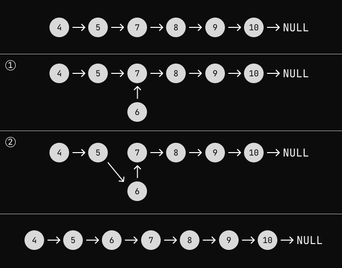

If we want to add a Node/element to an index first we need to traverse to the index.

[1]Then create a new Node that will point to the Node which we just found.

[2]Then make the previous Node point to the newly created Node.

#### What is a pointer?

If you know C/C++ you already know what pointers are, you can skip this section.

When we create a variable and store a value in it, it occupies a space in memory
and the location of that space has an address.

And if we have an address of a location in memory we can change the value stored there.

In mid-level languages like C/C++ and Rust, we have a special data type
that allows us to store the address of a location in the memory
in a special variable called pointers.

So we can have two variables that point to the same location in memory

In interpreted languages like Python and JavaScript, we do not have access
to addresses in memory but have references.

References are like pointers but they point to the actual value rather than the address.

In JavaScript, if you create a variable and assign it to a different variable
it will either copy the value or create a reference

In JavaScript primitive data types `Boolean`, `null`, 
`undefined`, `String`, and `Number` are always get copied

```js
let a = 1;
let b = a; // Copy the value of a into b
b++;

console.log(a) // => 1
console.log(b) // => 2
```
JavaScript has three data types that get passed by reference: `Array`, `Function`, `Object`

```js
let a = { value: 1 };
let b = a;
b.value = 10;

console.log(a.value) // => 10
console.log(b.value) // => 10
```

By using an object we have two variables that points to the same location in the memory.

This is how we will make one Node(a object) point to the other Node(a object).

#### Implementing Linked List

First, let's implement a Node using OOP

```js
class Node {
  constructor(value) {
    this.value = value;
    this.next = null;
  }
}
```

That's it, it's that easy to implement a Node for a linked list.

Now we need a class to store our list and have useful methods to work with our list.

```js
class LinkedList {
  constructor(firstValue) {
    if (firstValue !== undefined && firstValue !== null) {
      this.firstNode = new Node(firstValue);
      this.lastNode = this.firstNode; // Storing a refrence
      this.length = 1;

    } else {
      this.firstNode = null;
      this.lastNode = null;
      this.length = 0;
    }
  }

  push(value) {
    // Add a Node to the end
  }
}
```

What we are doing here is that in the constructor we have a choice to
put the first element in the list when we create a linked list.

We will always have a reference to the first Node in our list and the last Node.
If we have only one Node then it's both the first and the last Node.

We will also keep the count of the nodes in the `length` property.

Now let's implement the push method.

```js
class LinkedList {
  constructor(firstValue) {
    if (firstValue !== undefined && firstValue !== null) {
      this.firstNode = new Node(firstValue);
      this.lastNode = this.firstNode; // Storing a refrence
      this.length = 1;

    } else {
      this.firstNode = null;
      this.lastNode = null;
      this.length = 0;
    }
  }

  push(value) {
    if (this.lastNode) {
      const newNode = new Node(value)
      this.lastNode.next = newNode;
      this.lastNode = newNode;
    } else {
      this.firstNode = new Node(value);
      this.lastNode = this.firstNode; // Storing a refrence
    }
    this.length++;
  }
}
```

Because we have the reference to the last Node of the list adding a new Node is easy.
But first, we need to check if last Node exists because the list could be empty.

If it's empty then do the same thing we did in the constructor. If the last Node
exists then just create a new Node and store it in the `next`
of the last Node and then make the new Node the last Node.

Now we need a way to check if our Linked list is working properly so
let's make a method to print our linked list.

```js
class LinkedList {
  constructor(firstValue) {
    if (firstValue !== undefined && firstValue !== null) {
      this.firstNode = new Node(firstValue);
      this.lastNode = this.firstNode; // Storing a refrence
      this.length = 1;
        
    } else {
      this.firstNode = null;
      this.lastNode = null;
      this.length = 0;
    }
  }

  push(value) {
    if (this.lastNode) {
      const newNode = new Node(value)
      this.lastNode.next = newNode;
      this.lastNode = newNode;

    } else {
      this.firstNode = new Node(value);
      this.lastNode = this.firstNode; // Storing a refrence
    }

      this.length++;
  }

  print() {
    let currentNode = this.firstNode;
    
    while (currentNode) {
      console.log(currentNode.value);
      currentNode = currentNode.next;
    }
  }
}
```

As you can see it's working as intended.

```js
let test = new LinkedList(1);
test.push(2);
test.push(5);
test.push(7);
test.print(); 

// Output
// 1
// 2
// 5
// 7
```

Now let's add a method to add a value to the beginning of the list.

We'll call this `unShift` because that's the method for adding an element
to the beginning of the array is called in JavaScript.

```js
unshift(value) {
  const newNode = new Node(value);
  newNode.next = this.firstNode;
  this.firstNode = newNode;
  
  this.length++;
}
```

What we are doing here is first we make a new Node then make the new Node point
to the first Node in our list then make the new Node our first Node.

```js
let test = new LinkedList(1);
test.push(2);
test.push(5);
test.push(7);
test.unshift(10);
test.print();

// Output
// 10
// 1
// 2
// 5
// 7
```

Up until now, all the method that we have defined has O(1) time complexity
except the print function.

Now we are left with `lookup`, `insert` and `delete` operations.

All of them are similar and have O(n) time complexity.

Let's first implement a `traverse` method because the above method will depend on this.

What the` traverse` method will do is that it'll go through each node
one by one and return the node for the given index, with the index starting at 0.

```js
traverse(index) {
  if (index >= 0 && index < this.length) {
    let i = 0;
    let currentNode = this.firstNode;

    while (i < index && currentNode) {
      currentNode = currentNode.next;
      i++;
    }
    return currentNode;

  } else {
    return null;
  }
}
```

This method looks similar to the print method, what we are doing
different is first we are checking if the index is within the length
then traverse through the list and return the node at the index.

After running this test code we'll get some interesting results.

```js
let test = new LinkedList(1);
test.push(2);
test.push(5);
test.push(7);
test.unshift(10);
console.log(test.lookup(0));
console.log(test.lookup(1));
console.log(test.lookup(2));
console.log(test.lookup(10));

// Output
// Node {
//   value: 10,
//   next: Node { value: 1, next: Node { value: 2, next: [Node] } }
// }
// Node {
//   value: 1,
//   next: Node { value: 2, next: Node { value: 5, next: [Node] } }
// }
// Node {
//   value: 2,
//   next: Node { value: 5, next: Node { value: 7, next: null } }
// }
// null
```

If we print a node we can see the rest of the list after that node.
and If we try of get a node that doesn't exist we get null.

Now implementing the `lookup` method will be easy.

```js
lookup(index) {
  const node = this.traverse(index);

  if (node) {
    return node.value;
  } else {
    return null;
  }
}
```

All we need to do is return the value of the node if it exists.

Now let's do the `insert` method.

```js
insert(index, value) {
  const nodeAtIndex = this.traverse(index);
  const nodeAtPreviousIndex = this.traverse(index-1);

  if (nodeAtIndex) {
    const newNode = new Node(value);
    newNode.next = nodeAtIndex;

    if (nodeAtPreviousIndex) {
      nodeAtPreviousIndex.next = newNode;
    }

    this.length++;
  } else if (index === this.length) {
    this.push(value);
  }
}
```

Let's go step by step to see what this is doing.

First, we take two references, one for the node at the index and
the second one for the node at the previous index.

Then we check if the node at the index exists. If it does then
create a new node and make it point the node at the index.

Then check if the previous node exists and make the previous node point
the to the new node.

If the node at the index does not exist then if the index is the same
as the length of the list use the push method.

Now it's time for the last method in our list.

```js
delete(index) {
  const nodeAtNextIndex = this.traverse(index+1);
  const nodeAtPreviousIndex = this.traverse(index-1);

  if (nodeAtPreviousIndex) {
    nodeAtPreviousIndex.next = nodeAtNextIndex;
  }
}
```

To delete a node at an index you just need to make the previous node point
to the node next to the node at the given index.

Because JavaScript uses a garbage collector the node that no one has
reference to will automatically get deleted from the memory but in other languages
you may have to manually free the memory occupied by the node.

Here is the full implementaion of Linked List

```js
class Node {
  constructor(value) {
    this.value = value;
    this.next = null;
  }
}

class LinkedList {
  constructor(firstValue) {
    if (firstValue !== undefined && firstValue !== null) {
      this.firstNode = new Node(firstValue);
      this.lastNode = this.firstNode; // Storing a refrence
      this.length = 1;

    } else {
      this.firstNode = null;
      this.lastNode = null;
      this.length = 0;
    }
  }

  push(value) {
    if (this.lastNode) {
      const newNode = new Node(value)
      this.lastNode.next = newNode;
      this.lastNode = newNode;

    } else {
      this.firstNode = new Node(value);
      this.lastNode = this.firstNode; // Storing a refrence
    }

    this.length++;
  }

  print() {
    let currentNode = this.firstNode;

    while (currentNode) {
      console.log(currentNode.value);
      currentNode = currentNode.next;
    }
  }

  unshift(value) {
    const newNode = new Node(value);
    newNode.next = this.firstNode;
    this.firstNode = newNode;

    this.length++;
  }

  traverse(index) {
    if (index >= 0 && index < this.length) {
      let i = 0;
      let currentNode = this.firstNode;

      while (i < index && currentNode) {
        currentNode = currentNode.next;
        i++;
      }
      return currentNode;

    } else {
      return null;
    }
  }

  lookup(index) {
    const node = this.traverse(index);

    if (node) {
      return node.value;
    } else {
      return null;
    }
  }

  insert(index, value) {
    const nodeAtIndex = this.traverse(index);
    const nodeAtPreviousIndex = this.traverse(index-1);

    if (nodeAtIndex) {
      const newNode = new Node(value);
      newNode.next = nodeAtIndex;

      if (nodeAtPreviousIndex) {
        nodeAtPreviousIndex.next = newNode;
      }

      this.length++;
    } else if (index === this.length) {
      this.push(value);
    }
  }

  delete(index) {
    const nodeAtNextIndex = this.traverse(index+1);
    const nodeAtPreviousIndex = this.traverse(index-1);

    if (nodeAtPreviousIndex) {
      nodeAtPreviousIndex.next = nodeAtNextIndex;
    }

  }
}

let test = new LinkedList(1);
test.push(2);
test.push(5);
test.push(7);
test.unshift(10);
test.print();
console.log("-----------")
test.insert(3, 11);
test.print();
console.log("-----------")
test.delete(3);
test.print();
```

I know this isn't the most efficient implementation of Linked List because
in the `insert` and `delete` methods I'm calling the `traverse` method twice
which can be avoided but I think this is good enough to show how a Linked List works.

#### Doubly Linked List

What I just showed you is called a Singly Linked List because in it a Node only
points to a single Node.

Imagine a situation where you want to get a Node at a closer index
to the last Node.

In a Singly Linked List, you would have to traverse through the list from the
beginning to almost the end of the list.

It would be great if we can traverse from the end of the list.

This is what Doubly Linked List is for. In Doubly Linked List a Node
points to both the next and previous Node. Which allows us to traverse
from the end of the list.

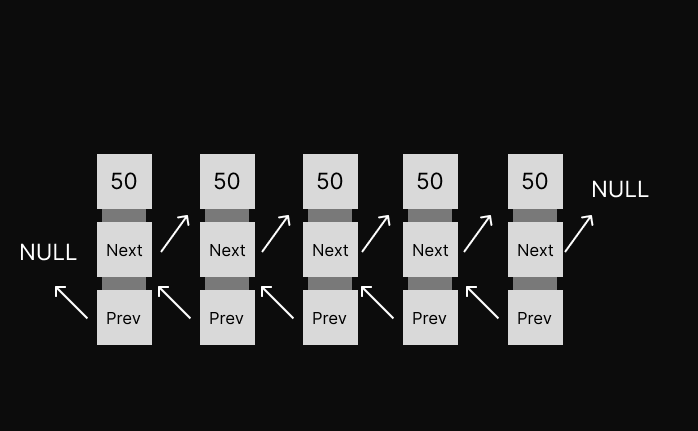

Let's convert our Singly Linked List to a Doubly Linked List.

Inside the `Node` class you only need to add the `previous` pointer.

```js
class Node {
  constructor(value) {
    this.value = value;
    this.next = null;
    this.previous = null;
  }
}
```

Inside the `LinkedList` class, there is no need to change
anything in the constructor.

Inside the 'push' method you need to add one line:

```js
push(value) {
  if (this.lastNode) {
    const newNode = new Node(value)
    this.lastNode.next = newNode;
    newNode.previous = this.lastNode; // Add this
    this.lastNode = newNode;
  } else {
    this.firstNode = new Node(value);
    this.lastNode = this.firstNode;
  }

  this.length++;
}
```

We also need to do the same for the `unshift` method:

```js
unshift(value) {
  const newNode = new Node(value);
  newNode.next = this.firstNode;
  this.firstNode = newNode;
  this.firstNode.next.previous = this.firstNode; // Add this

  this.length++;
}
```

Let's skip the `traverse` for now, we'll come back to them later.

First, let's fix the `insert` and `delete` methods.

```js
insert(index, value) {
  const nodeAtIndex = this.traverse(index);
  const nodeAtPreviousIndex = nodeAtIndex.previous; // Change this

  if (nodeAtIndex) {
    const newNode = new Node(value);
    newNode.next = nodeAtIndex;
    nodeAtIndex.previous = newNode; // Add this

    if (nodeAtPreviousIndex) {
      nodeAtPreviousIndex.next = newNode;
      newNode.previous = nodeAtPreviousIndex; // Add this
    }
    
    this.length++;
  } else if (index === this.length) {
    this.push(value);
  }
}
```

Now we also don't need to call the traverse function twice!

```js
delete(index) {
  const nodeAtIndex = this.traverse(index);
  const nodeAtNextIndex = nodeAtIndex.next;
  const nodeAtPreviousIndex = nodeAtIndex.previous;

  if (nodeAtPreviousIndex) {
    nodeAtPreviousIndex.next = nodeAtNextIndex;
    nodeAtNextIndex.previous = nodeAtPreviousIndex; // Add this
  }
}
```

Now to test if this works we'll add another print method that will
traverse the list in reverse order(from the last Node to the first Node).

```js
printReverse() {
  let currentNode = this.lastNode;

  while(currentNode) {
    console.log(currentNode.value);
    currentNode = currentNode.previous;
  }
}
```

To test your code run this:

```js
let test = new LinkedList(1);
test.push(2);
test.push(5);
test.push(7);
test.unshift(10);
test.print();
console.log("---- Reverse ----")
test.printReverse();
console.log("---- Insert 11 at 3 ------")
test.insert(3, 11);
test.print();
console.log("---- Reverse ----")
test.printReverse();
console.log("---- Delete at 3 -----")
test.delete(3);
test.print();
console.log("---- Reverse ----")
test.printReverse();
```

The output should look like this:

```
10
1
2
5
7
---- Reverse ----
7
5
2
1
10
---- Insert 11 at 3 ------
10
1
2
11
5
7
---- Reverse ----
7
5
11
2
1
10
---- Delete at 3 -----
10
1
2
5
7
---- Reverse ----
7
5
2
1
10
```

Now that everything is working correctly we can make an
improvement in our `traverse` method.

We can now traverse in the reverse order if the index is closer to
the last item that the first item.

```js
traverse(index) {
  if (index >= 0 && index < this.length) {
    // If index is closer to the first element then traverse from the first element
    if (index < this.length/2) {
      let i = 0;

      let currentNode = this.firstNode;
      while (i < index && currentNode) {
        currentNode = currentNode.next;
        i++;
      }

      return currentNode;
    } else { // If index is closer to the last element then traverse from the last element
      let i = this.length - 1;
      let currentNode = this.lastNode;

      while (i > index && currentNode) {
        currentNode = currentNode.previous;
        i--;
      }

      return currentNode;
    }
  } else {
    return null;
  }
}
```

And here is the full implementation of Doubly Linked List:

```js
class Node {
  constructor(value) {
    this.value = value;
    this.next = null;
    this.previous = null;
  }
}

class LinkedList {
  constructor(firstValue) {
    if (firstValue !== undefined && firstValue !== null) {
      this.firstNode = new Node(firstValue);
      this.lastNode = this.firstNode;
      this.length = 1;
    } else {
      this.firstNode = null;
      this.lastNode = null;
      this.length = 0;
    }
  }

  push(value) {
    if (this.lastNode) {
      const newNode = new Node(value)
      this.lastNode.next = newNode;
      newNode.previous = this.lastNode;
      this.lastNode = newNode;
    } else {
      this.firstNode = new Node(value);
      this.lastNode = this.firstNode;
    }

    this.length++;
  }

  print() {
    let currentNode = this.firstNode;

    while (currentNode) {
      console.log(currentNode.value);
      currentNode = currentNode.next;
    }
  }

  printReverse() {
    let currentNode = this.lastNode;

    while(currentNode) {
      console.log(currentNode.value);
      currentNode = currentNode.previous;
    }
  }

  unshift(value) {
    const newNode = new Node(value);
    newNode.next = this.firstNode;
    this.firstNode = newNode;
    this.firstNode.next.previous = this.firstNode;

    this.length++;
  }

  traverse(index) {
    if (index >= 0 && index < this.length) {
      // If index is closer to the first element then traverse from the first element
      if (index < this.length/2) {
        let i = 0;
        let currentNode = this.firstNode;

        while (i < index && currentNode) {
          currentNode = currentNode.next;
          i++;
        }

        return currentNode;
      } else { // If index is closer to the last element then traverse from the last element
        let i = this.length - 1;
        let currentNode = this.lastNode;

        while (i > index && currentNode) {
          currentNode = currentNode.previous;
          i--;
        }

        return currentNode;
      }
    } else {
      return null;
    }
  }

  lookup(index) {
    const node = this.traverse(index);

    if (node) {
      return node.value;
    } else {
      return null;
    }
  }

  insert(index, value) {
    const nodeAtIndex = this.traverse(index);
    const nodeAtPreviousIndex = nodeAtIndex.previous;

    if (nodeAtIndex) {
      const newNode = new Node(value);
      newNode.next = nodeAtIndex;
      nodeAtIndex.previous = newNode;

      if (nodeAtPreviousIndex) {
        nodeAtPreviousIndex.next = newNode;
        newNode.previous = nodeAtPreviousIndex;
      }

      this.length++;
    } else if (index === this.length) {
      this.push(value);
    }
  }

  delete(index) {
    const nodeAtIndex = this.traverse(index);
    const nodeAtNextIndex = nodeAtIndex.next;
    const nodeAtPreviousIndex = nodeAtIndex.previous;

    if (nodeAtPreviousIndex) {
      nodeAtPreviousIndex.next = nodeAtNextIndex;
      nodeAtNextIndex.previous = nodeAtPreviousIndex;
    }

  }
}

let test = new LinkedList(1);
test.push(2);
test.push(5);
test.push(7);
test.unshift(10);
test.print();
console.log("---- Reverse ----")
test.printReverse();
console.log("---- Insert 11 at 3 ------")
test.insert(3, 11);
test.print();
console.log("---- Reverse ----")
test.printReverse();
console.log("---- Delete at 3 -----")
test.delete(3);
test.print();
console.log("---- Reverse ----")
test.printReverse();
```


#### Reversing a Linked List

This is the most common interview question related to linked list.

And we are going to use a Singly Linked List for this because in
Doubly Linked List there is not need to reverse it.

Remember that we don't to want to print the Linked List in a reverse
order like we did in the Doubly Linked List.

We want to make the given Linked List in the reverse order.

The algorithm to reverse a Linked List looks like this:

```
If the linked list has elements less or equal to 1 then do nothing.

Else get the reference to the first and the second Node to the
`first` and `second` variable and make the `first` LinkedList's last node;

While the second Node exists:
  Store the reference to the `next` of the `second` variable in a `temp` variable.
  Make the `second` variable point to the `first`.
  `first` is now `second`.
  `second` is now `temp`.

Now make the `next` of LinkedList's first Node `null` because it's now the last element.
And make `first` the LinkedList's first element.
```

Now that's confusing as hell but before I explain what is
going on here let's look at the JavaScript code.

```js
reverse() {
  if (this.length <= 1) {
    // Do nothing
  } else {
    let first = this.firstNode;
    let second  = first.next;
    this.lastNode = first;

    while(second) {
      const temp = second.next;
      second.next = first;
      first = second;
      second = temp;
    }

    this.firstNode.next = null;
    this.firstNode = first;
  }
}
```

This is one of the most difficult concepts to understand,
basically what we are doing is we have two pointers that point
to the first and second Node of the list and as we loop through the
list we make the second Node point to the first Node.

It's very hard to understand this algorithm by just reading so I recommend
you to watch this [Youtube Video](https://www.youtube.com/watch?v=G0_I-ZF0S38).

### Stacks and Queues

Stacks and Queues are very similar, there are both linear data-structure
and linear data structures allow us to traverse(go through elements sequentially)
and only one data element can be directly reached.

#### Stacks

A stack is a type of data structure where data elements are stacked on top of each other like a stack of plates. And you can only touch the top plate(when inserting, removing, or peeking).

To get to the bottom plate you will have to remove the top plates one by one.

And if you want to add a data element you can only put it on the top of the stack.

This is called LIFO(Last In First Out) because the last one to get
inserted into the stack(the top plate) will be the first one to get out.

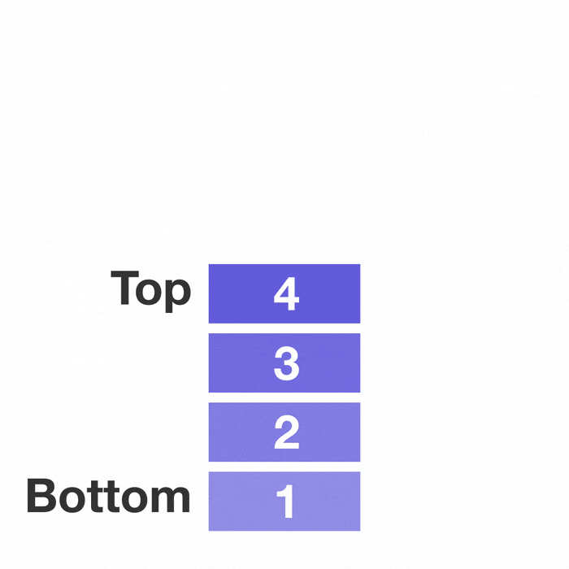

The act of inserting an element into the stack is called Push
and the act of removing an element is called Pop.

Programming languages use the stack data structure to keep track of function calls,
it's known as Call Stack.

When a function gets called it gets pushed into the Call Stack and starts to execute executed.
When another function inside that function gets called the other function gets pushed
to the stack and popped when it's done executing.

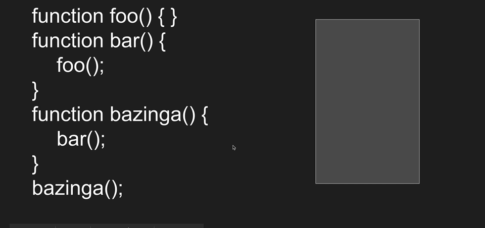

Call Stack has limited space and it can get overflowed if you use a recursive function that
never ends causing the program to crash with Stack Overflow.

Another good example of stack is browser history ( ͡° ͜ʖ ͡°).

When we visit a site it gets pushed to our histroy and when we press the back button it gets poped.

##### Stack Operations

**Lookup** O(n)

**Push** O(1) Push add the element on top of the last element

**Pop** O(1) Pop remove the top last element

**Peek** O(1) The Peek points to the last element.

#### Queues

Queue data structure is like a line of people waiting to
go inside a theater.

The first person in the line will go first inside the theater and the last person in the line will be the last one
to go inside the theater.

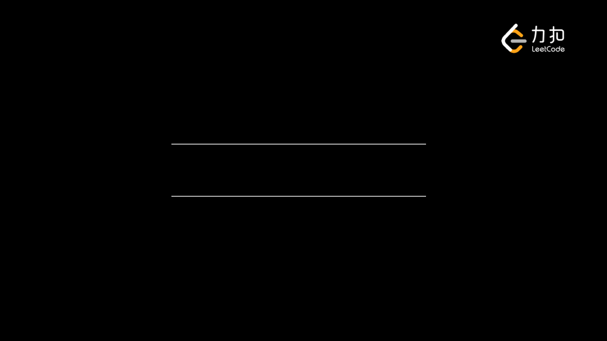

It's opposite of Stack. In Stack the first plate to get in is
the last plate to get out.

But in a Queue the first person to go in is the first one to
go out which is called FIFO(First In First Out).

Queues are useful when you are making an App where you need a waiting list.

##### Queue Operations

**Lookup** O(n) If you follow the constraints otherwise O(1)

**Enqueue** O(1) Enqueue add the element before the last element so the new element becomes the last element.

**Dequeue** O(1) Dequeue remove the first element and the second element becomes the first element.

**Peek** O(1) Peek points to the first element

#### Stack Vs Queue

Stacks are used in areas like undo/redo, browser history, Syntax parsing, and Virtual Machines.

Queues are used for CPU task scheduling, Handling of interrupts, and waiting list in an App.


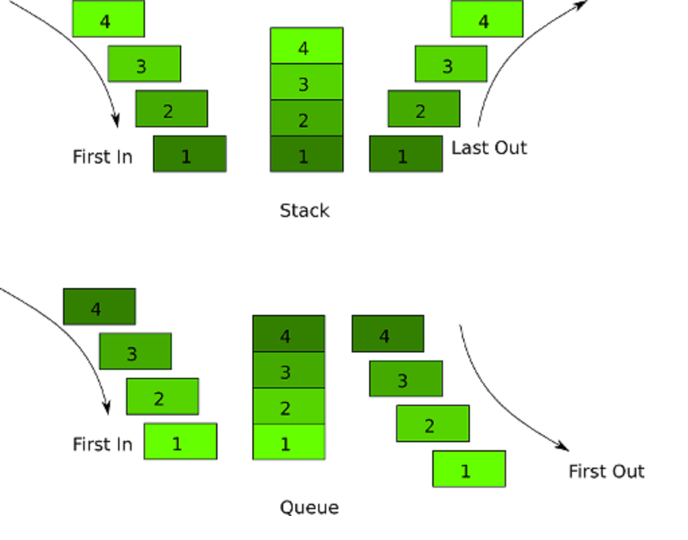

#### Implementing Stack and Queues

There is no need to create another class for Stack because you can just
use an array because Stack and Array are the same if you only use the push and pop operation and read only the last element of the array.

```js
// Stack using array
let myStack = [1,2,3,4,5];
myStack[myStack.length-1] // Peek
myStack.push(); // In some languages it's called append
myStack.pop(); // Pop
```

We can also implement stack using Linked List but in all Stack-related interview questions you will be given an array.

The Queue on the other hand is similar to Linked List if when removing an element you remove the first element and when adding an element you add the to the end of the list and read only the first element of the list.

```js
let myQueue = new LinkedList(); // The linked list from the previous section

myQueue.lookup(0) // Peek
myQueue.push() // Enqueue
myQueue.remove(0) // Dequeue
```

#### Implement Queue using Stacks

This is the most commonly asking question related to Stack and Queues.

A queue is FIFO (first-in-first-out) but a stack is LIFO (last-in-first-out). This means the newest element must be pushed to the bottom of the stack. To do that we need to unilize two stacks.

```js
class Queue {
  constructor() {
    this.main = [];
    this.temp = [];
  }

  enqueue() {}
  dequeue() {}
  peek() {}
}
```

Because the first element to go in needs to be the first element of our main stack we need to pop and push all the elements from the main stack to the temp stack and then push the new element to the temp stack. After that pop and push all the elements from the temp stack back the the main stack.


```js
enqueue(element) {
  while(this.main.length > 0) {
    this.temp.push(this.main.pop());
  }

  this.temp.push(element);

  while(this.temp.length > 0) {
    this.main.push(this.temp.pop());
  }
}
```

This makes the enqueue method O(n) instead of O(1) but this is a stupid question anyway so we don't care.

Here is the full implementaion with dequeue and peek:

```js
class Queue {
  constructor() {
    this.main = [];
    this.temp = [];
  }

  enqueue(element) {
    while(this.main.length > 0) {
      this.temp.push(this.main.pop());
    }

    this.temp.push(element);

    while(this.temp.length > 0) {
      this.main.push(this.temp.pop());
    }
  }

  dequeue() {
    return this.main.pop();
  }

  peek() {
    return this.main[this.main.length - 1];
  }
}

const myQueue = new Queue();
console.log(myQueue.peek());
myQueue.enqueue('Roy');
myQueue.enqueue('Dishant');
myQueue.enqueue('Burhan');
console.log(myQueue.peek());
myQueue.dequeue();
myQueue.dequeue();
myQueue.dequeue();
console.log(myQueue.peek());
```

### Trees

The tree data structure is based on Linked List and it is called "tree" because
it looks like an upside-down tree.

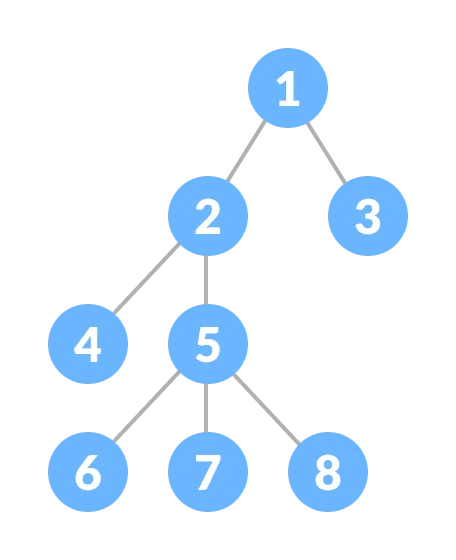

Here we have a root node that every child descends from.
A node can only have one parent node but can have any number
of children nodes. So we have a uni directional parent-child relationship.

The tree data structure is important because you work with them every day.

The files and folders in your disk are stored in a tree structure.

And if you have coded HTML you may know that it also represents a Tree
Structure of HTML Elements.

**Terms in Tree:**

- **Root**: The root of a tree is the topmost node of the tree that has no parent node.
There is only one root node in every tree.

- **Edge**: Edge acts as a link between the parent node and the child node.

- **Leaf**: A node that has no child is known as the leaf node.
It is the last node of the tree. There can be multiple leaf nodes in a tree.

- **Depth of Node**: The depth of the node is the distance from the root node
to that particular node.

- **Height of Node**: The height of the node is the distance from that node to the
deepest node of the tree.

- **Height of tree**: The Height of the tree is the maximum height of any node.

#### Why use Trees?

1. One reason to use trees might be because you want to store information that naturally
forms a hierarchy. For example, the file system on a computer:


2. Trees (with some ordering e.g., BST) provide moderate access/search
(quicker than Linked List and slower than arrays). 

3. Trees provide moderate insertion/deletion (quicker than Arrays and slower
than Unordered Linked Lists). 

4. Like Linked Lists and unlike Arrays, Trees don't have an upper limit on the
number of nodes as nodes are linked using pointers.

#### Main applicaiton of Trees:

- Manipulate hierarchical data. 
- Make information easy to search. 
- Manipulate sorted lists of data.
- Form of multi-stage decision-making.

#### Binary Tree

A Binary Tree is a type of Tree Data Structure where a parent node can only
have either 0, 1 or two nodes.

Since each element in a binary tree can have only 2 children, we typically name them
the left and right child.


#### Operations on Binary Tree

**Inserting** O(n)

**Removing** O(n)

**Searching** O(n)

#### Types of Binary Tree

##### Full Binary Tree:

A full Binary tree is a special type of binary tree in which every
parent node/internal node has either two or no children. It is also
known as a proper binary tree.

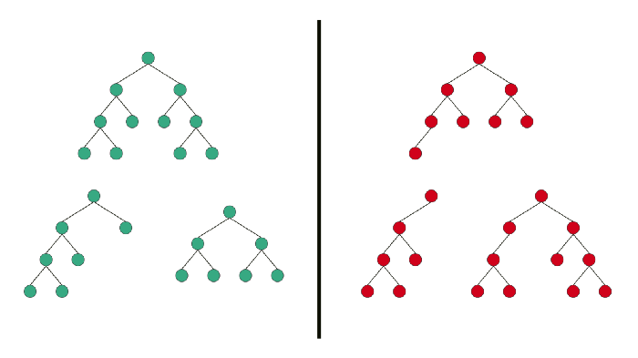

##### Complete Binary Tree:

A Binary Tree is a Complete Binary Tree if all the levels are
completely filled except possibly the last level and the last level
has all keys as left as possible.

A complete binary tree is just like a full binary tree, but with two major differences:

- Every level must be completely filled.
- All the leaf elements must lean towards the left.
- The last leaf element might not have a right sibling i.e. a complete 
binary tree doesn't have to be a full binary tree.

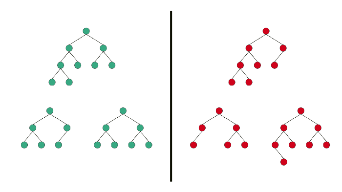

##### Perfect Binary Tree:

A Binary tree is a Perfect Binary Tree in which all the internal nodes have two
children and all leaf nodes are at the same level. 

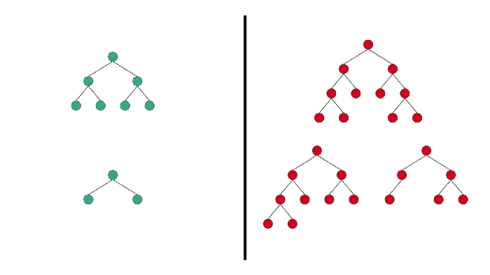

##### Balanced Tree:

A binary tree is balanced if the height of the tree is O(Log n) where n is
the number of nodes.

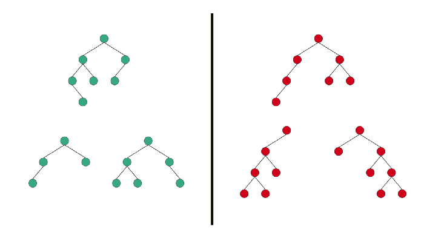

##### Degenerate(or Pathological) Binary Tree:

A Binary Tree is Degenerate Binary Tree where every parent node has only one child node.

This is bacially a Linked List.

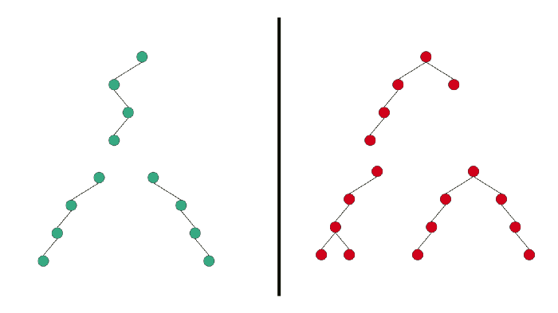

#### Binary Search Tree

Binary Search Tree are really good at searching because it's sorted.

For example take a look at this Tree:

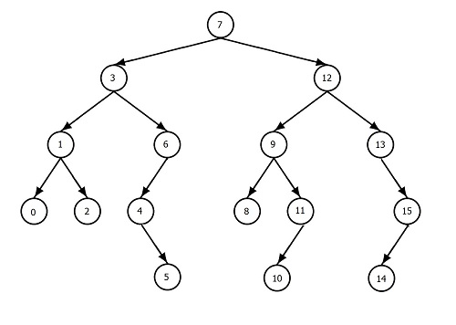

Here the right side of each node is smaller than it's parent node and
the right side of each node is bigger than it's parent node.

And this makes searching very easy because at each node we know what
direction we need to go the find our node. And this is how we avoid
checking through all the nodes.

##### Operations on Binary Search Trees

**Lookup** O(Log n)

**Insert** O(Log n)

**Delete** O(log n)

##### Why O(Log n)?

In computer science, we use Log with base 2 instead of base 10.

And if we put the number of nodes of a Binary Tree and
the log2 function with one added we will get the height of the Binary Tree.

You could look at it like this

log2(n + 1) = h

Where n is the number of nodes and h is the height.

log2(1 + 1) = 1

log2(3 + 1) = 2

log2(7 + 1) = 3

log2(15 + 1) = 4

log2(31 + 1) = 5

And in a Binary Tree the number of steps to get to
the desired node is equal the height of the Tree because
at each node, we know which way we need to go.

So the Big O becomes O(log(n+1)) and after removing the constant
it becomes O(log n).

#### Balanced vs Unbalanced Binary Tree

Binary trees have several flavors. A balanced binary tree is one in which no leaf nodes are 'too far' from the root.

For example, one definition of balanced could require that all leaf nodes have a depth that differs by at most 1.

An unbalanced binary tree is one that is not balanced.

Here is what a Balanced Binary Tree looks like:


On the right side, we have Unbalanced Binary Trees, and on
the left side we have Balanced Binary Trees.

The problem with Unbalanced Binary Tree is that the
Big O of access time in an Unbalanced Binary tree is O(n)
where in a Balanced Binary Tree the access time is O(log n).

That is because an unbalanced tree built from sorted data is effectively the same as a linked list.

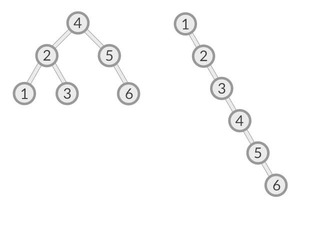

So keeping a Binary Tree balanced is important.


#### Implementing Binary Search Tree

After so much theory now it's time to code our first Tree.

Just like the Linked List we need a class for our Node.

```js
class Node {
  constructor(value) {
    this.left = null;
    this.right = null;
    this.value = value;
  }
}
```

And a class for the Tree

```js
class BST {
  constructor() {
    this.root = null;
  }

  insert() {}
  lookup() {}
  remove() {}
}
```
BST stands for Binary Search Tree, if you are confused.

In this class we'll have three methods: `insert`, `lookup` and `remove`.

Let's Implement the `insert` first:

```js
insert(value) {
  const newNode = new Node(value);

  // If the tree is empty then put the new node at the root
  if (this.root === null) {
    this.root = newNode;
  } else {

    let currentNode = this.root;

    // Traverse through the nodes
    while(true) {
      // Left
      if (value < currentNode.value) {
        // If empty left space found put the new node there
        if (!currentNode.left) {
          currentNode.left = newNode;
          break;
        } else {
          // If left node exist move to the left node
          currentNode = currentNode.left
        }
      } else { // Right
        // If empty right space found put the new node there
        if (!currentNode.right) {
          currentNode.right = newNode;
          break;
        } else {
          // If right node exist move to the right node
          currentNode = currentNode.right;
        }
      }
    }
  }
}
```

First we check if the root node is null if it's null then the tree is empty
So we put the new Node at the root.

Then we traverse through the tree at each node we are checking which way
to go(bigger value is to right and smaller value is to left) and if the next
node is empty put the new node there else move to that node.


You can test this out by running this

```js
let tree = new BST();

tree.insert(5);
tree.insert(2);
tree.insert(18);
tree.insert(-4);
tree.insert(3);

console.log(JSON.stringify(tree.root))
```

The output will give a JSON string that you can put in any online JSON tree
viewer.

The `lookup` method is very similar to the `insert`

```js
lookup(value) {
  if (this.root === null) {
    return null;
  }

  let currentNode = this.root;

  while (currentNode.value !== value) {
    if (value > currentNode.value) {
      if (currentNode.right === null) {
        return null;
      } else {
        currentNode = currentNode.right;
      }
    } else {
      if (currentNode.left === null) {
        return null;
      } else {
        currentNode = currentNode.left;
      }
    }
  }

  return currentNode;
}
```

At each step in the loop, we are checking if the current node is equal to the given
value if not then check the which side we need to go next if the next node is null
then return null because we couldn't find the value.

Now the last method in our list is the `remove` method which is way too complicated
to implement so I'm going to skip over this one because no one will ever ask you to
implement a Binary Search Tree in an Interview.

I think this is enough for you to understand how Binary Search Tree works but if
you want to know how to implement remove for a Binary Seach Tree you can watch
[this video](https://www.youtube.com/watch?v=wMyWHO9F1OM).


#### AVL Trees and Red Black Trees

They are more advance types of Trees but they are not that important to learn
unless you are preparing for MANGA(Meta, Apple, Netlify, Google and Amazon) Interview.

So I'll put some resources here if you want to learn about them.

AVL Trees: https://medium.com/basecs/the-little-avl-tree-that-could-86a3cae410c7

Red Black Tree: https://medium.com/basecs/painting-nodes-black-with-red-black-trees-60eacb2be9a5

#### Heap and Binary Heap

A Heap is a special Tree-based data structure in which the tree is a complete binary tree.
And it may sound fimiliar but it is not related to Heap memory.

Generally, Heaps can be of two types:

**Max-Heap**: In a Max-Heap the key present at the root node must be greatest among the keys
present at all of it's children. The same property must be recursively
true for all sub-trees in that Binary Tree.

**Min-Heap**: In a Min-Heap the key present at the root node must be minimum among the
keys present at all of it's children. The same property must be recursively true
for all sub-trees in that Binary Tree.

Heap is also called Binary Heap, there are the same thing.

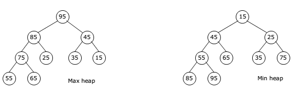

#### Operations on Binary Heap

**Lookup** O(n) We never use this in Binary Heap.

For Max-Heap Lookup of largest number is O(1).

For Min-Heap Lookup of smallest number O(1).

**Insert** O(1) on average, O(log n) in worst case.

**Delete** O(1) on average, O(log n) in worst case.


When we work with Binary Heap we generally only look for the top most
element. I'll be either Pushing, Popping, or Reading the first Element all of these have O(1) time complexity.

#### Why use Binary Heap

Binary Heap is usefull if you want to have a list of items that
stays sorted when you delete or insert an item. So it's useful when you
want to get the data with either the highest priorty(Max Heap) or the lowest priorty(Min Heap).

#### Implementing Binary Heap

Generally when you are given a question in an interview that
requires a Binary Heap, you do not have to implement Binary Heap
from scratch, Like Arrays and Hashmaps, Binary Heap also comes with most
Programming Languages.

But if you want to understand how a Binary Heap works by implementing
it then you can read this [article](https://blog.bitsrc.io/implementing-heaps-in-javascript-c3fbf1cb2e65).

Because JavaScript doesn't have Binary Heap in-built you can just copy
and paste an implementation of Binary Heap when solving a Leetcode Problem.
And if you are in an interview ask the interviewer if they want you to
implement the Binary Heap or you can just a npm library or CTRL+C + CTRL + V.

Most likely you will never have to implement Binary Heap from scratch. You just need to know how to use this.

#### How to solve a problem with Binary Heap

Let's solve a Leetcode problem that can be solved efficently by
Binary Heap.

Q. Kth Largest Element in a Stream

Design a class to find the kth largest element in a stream. Note that it
is the kth largest element in the sorted order, not the kth distinct element.

Implement KthLargest class:

`KthLargest(int k, int[] nums)` Initializes the object with the integer k
and the stream of integers nums.

`int add(int val)` Appends the integer val to the stream and returns the element representing the kth largest element in the stream.

**Example 1**:

```
Input

["KthLargest", "add", "add", "add", "add", "add"]
[[3, [4, 5, 8, 2]], [3], [5], [10], [9], [4]]

Output

[null, 4, 5, 5, 8, 8]

Explanation

KthLargest kthLargest = new KthLargest(3, [4, 5, 8, 2]);
kthLargest.add(3);   // return 4
kthLargest.add(5);   // return 5
kthLargest.add(10);  // return 5
kthLargest.add(9);   // return 8
kthLargest.add(4);   // return 8
```

**Answer**:

The most naive approach to solve this problem is to just sort the array
using the built-in `sort` method when we first initialize the array.

Then finding the kth element would take `n` amount of time where `n` is the
size of the array. And adding an element to its correct
place will also take `n` amount of time.

But we can solve this problem with a better time complexity using a Heap.

And you may think that the max heap is the best solution for this because
inserting an element to a max heap takes log n time and we will always have
the biggest number at the top so finding kth element would take k amount of time.

So the overall time complexity of the `add` function will become O(k log n).

But if we use a min-heap we can make this even more time-efficient to
O(log k).

This is possible because we only want the kth element so if we will only store
the k largest element in a min-heap so we will have the kth largest number at
the top. And when we add a new number to the min-heap will we pop the smallest
number in the heap so the kth largest element will always be at the top.

I'm going to use Python for this because JavaScript doest not come
with Heap Data Structures.

The code:

```python
import heapq # Min heap implementation in python

class KthLargest:
  def __init__(self, k: int, nums: List[int]): # O(log n + n) = O(log n)
    self.min_heap, self.k = nums, k

    heapq.heapify(self.min_heap) # O(log n)

    # Removing numbers that are not k largest O(n)
    while len(self.min_heap) > self.k:
      heapq.heappop(self.min_heap)

  def add(self, val: int) -> int: # O(log k + log k) = O(log k)
    heapq.heappush(self.min_heap, val) # Add new number O(log k)

    # Pop minimum number if the size of heap is bigger than k
    if len(self.min_heap) > self.k:
      heapq.heappop(self.min_heap) # O(log k)

    return self.min_heap[0]
```

#### Priority Queue

The most common use case of heap data structure is using it as a Priority Queue.

In a normal queue, the first one to go in is the first one to come out.

But there are situations where you wanna prioritize the elements of a queue.
Where the element with the highest priority comes out first.

We can use a max-heap in that case.

#### Solve a problem using Priority Queue or max-heap

Q. Last Stone Weight

You are given an array of integers `stones` where `stones[i]` is the weight of the ith stone.

We are playing a game with the stones. On each turn, we choose the **heaviest two stones** and
smash them together. Suppose the heaviest two stones have weights `x` and `y` with `x <= y`.

The result of this smash is:

- If `x == y`, both stones are destroyed, and
- If `x != y`, the stone of weight `x` is destroyed, and the stone of weight `y`
has new weight `y - x`.

At the end of the game, there is **at most one** stone left.

Return the weight of the last remaining stone. If there are no stones left, return `0`.

**Example 1**:

```
Input: stones = [2,7,4,1,8,1]

Output: 1

Explanation: 

We combine 7 and 8 to get 1 so the array converts to [2,4,1,1,1] then,
we combine 2 and 4 to get 2 so the array converts to [2,1,1,1] then,
we combine 2 and 1 to get 1 so the array converts to [1,1,1] then,
we combine 1 and 1 to get 0 so the array converts to [1] then that's
the value of the last stone.
```

```
Example 2:

Input: stones = [1]

Output: 1
```

**Answer**:

Since Python doesn't have a max heap we'll store all the
numbers as negative and convert them to positive when we need it. Other than that, everything is explained well in the
question what we have to do.


```python
class Solution:
  def lastStoneWeight(self, stones: List[int]) -> int:
    self.max_heap = []
    
    # Storing the weights as negative
    # Because heapq is a min heap
    for stone in stones:
      heapq.heappush(self.max_heap, -stone)
        
    while len(self.max_heap) > 1:
      first = heapq.heappop(self.max_heap)
      second = heapq.heappop(self.max_heap)
        
      if first != second:
        new_stone = first - second
        heapq.heappush(self.max_heap, new_stone)
    
    if len(self.max_heap) == 0:
      return 0
    
    return -self.max_heap[0]
```

The overall time complexity of this is O(n log n).

And the space complexity of this is O(n).

#### Trie

A trie (pronounced as "try") or prefix tree is a tree data structure
used to efficiently store and retrieve keys in a dataset of strings.

There are various applications of this data structure,
such as autocomplete and spellchecker.

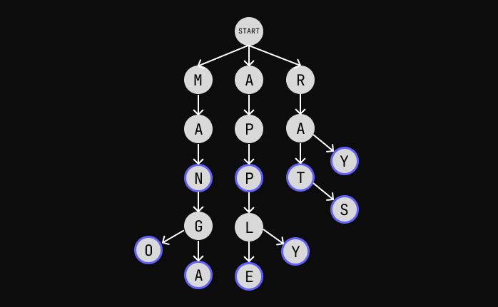

In the above example we have the words "Apple", "Apply", "App", "Manga", "Mango",
"Ray", "Rat", and "Rats".

The letters maked as blue shows where a word ends.

Unlike other Trees, The root node in a Trie doesn't hold any value.

### Implementing Trie

The implementation of our Trie will have three methods:

- `insert(word)` will insert a word into the trie.
- `search(word)` will return `true` if a word exists and `false` otherwise.
- `startsWith(word)` will return `true` if a word exists that starts with the given
word otherwise `false`.

A node in a Trie does three things: Storing a value, Pointing to other nodes, and
marking if the node is a end of a word.

```js
class TrieNode {
  constructor(value) {
    this.value = value;
    this.nexts = {};
    this.end = false;
  }
}
```

We are using a hashmap because it will make finding the next node faster than
using an array. O(n) for array and O(1) for hashmap.

The Trie class:

```js
class Trie {
  constructor() {
    this.root = new TrieNode(null);
  }

  insert(word) {}
  search(word) {}
  startsWith(word) {}
}
```

Let's first implement the `insert` method.

```js
insert(word) {
  let currentNode = this.root;

  for (let i = 0; i < word.length; i++) {
    const letter = word[i];

    if (currentNode.nexts[letter]) {
      currentNode = currentNode.nexts[letter];

      if (i === word.length-1) {
        currentNode.end = true;
      }

      continue;
    } else {
      let newNode = new TrieNode(letter);

      currentNode.nexts[letter] = newNode;

      currentNode = newNode;

      if (i === word.length-1) {
        currentNode.end = true;
      }

      continue;
    }
  }
}
```

This may look very complicated but it is a very simple algorithm.

We are starting from the root node and looping over every letter of the word.

If the current letter exists in the current node then move to that node and
move to the next letter.

If the current letter does not exist in the current node then create a new
node and add it to the next of our current node then move to the new node and 
letter.

If we are at the end of the word mark the current node or the new now as the
end.

This takes O(n) time where n the length of the word.


The `search` method:

```js
search(word) {
  let currentNode = this.root;

  for (let i = 0; i < word.length; i++) {
    const letter = word[i];

    if (!currentNode.nexts[letter]) {
      return false;
    }

    currentNode = currentNode.nexts[letter];
  }

  return currentNode.end;
}
```

We will traverse in the same way as we did in the `insert` method and if a
letter does not exist we will return false.

After the loop we will simply return the `end` property of the current node.

The `starsWith` method is almost same as the `seach` method except the last
line.

```js
startsWith(prefix) {
  let currentNode = this.root;

  for (let i = 0; i < prefix.length; i++) {
    const letter = prefix[i];

    if (!currentNode.nexts[letter]) {
      return false;
    }

    currentNode = currentNode.nexts[letter];
  }

  return Object.keys(currentNode).length > 0;
}
```

If the last letter of the word has more letters after it then it has more
words after it.

### Graphs

Graph is a collection of interconnected nodes. Kind of like the Internet.

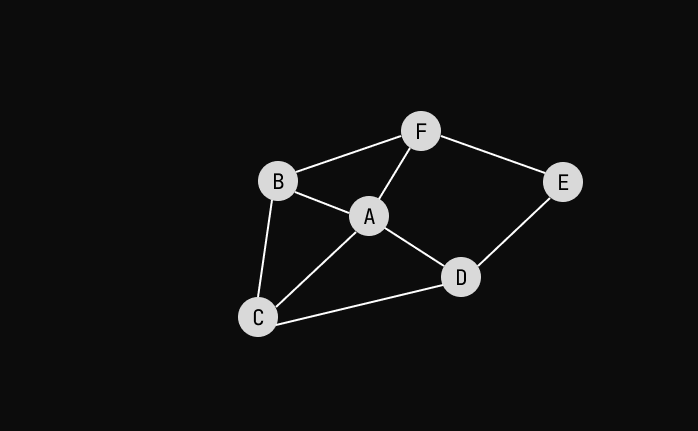

The lines connecting two nodes are called Edge.
And the nodes are sometimes referred to as Vertex.

Graphs are useful to model real-world relationships. Facebook uses it to track
users' relationships with others, Amazon uses it for their recommendation engine.
Google uses it in Google Maps where each node is a city and the edges are roads.

#### Types of Graphs

##### Directed and Undirected

Pretty staightforward from looking at this picture.


In a Directed Graph, we can only go forward from one node to another.

But In an Undirected Graph, we can go forward and backward.

Facebook uses Undirected Graph because if `person1` is a friend of `person2`.
`person2` is also a friend of `person1` it's a unidirectional relationship.

Twitter uses Directed Graph because if `person` follows `person2` that doesn't
necessarily means `person2` follows `person1`.

Note that we can have unidirectional edges in a Directed Graph.

##### Weighted and UnWeighted

In a Weighted Graph, edges have weight on them. It can represent anything.

As for Google Maps, the weight on an edge is the distance between two cities.
Which is how Google Maps can calculate the shortest path between two locations.

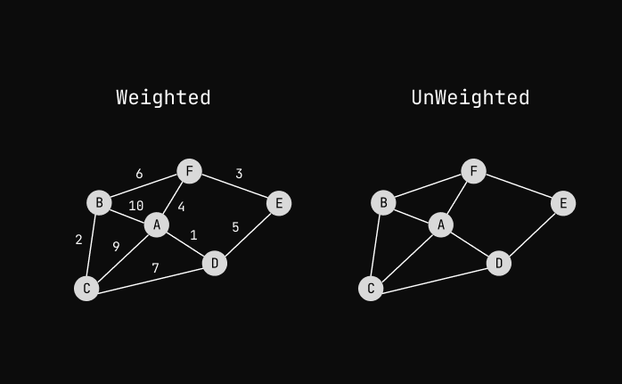


##### Cyclic vs Acyclic

A Graph is called Cyclic Graph if there's at least one cycle on nodes is present.

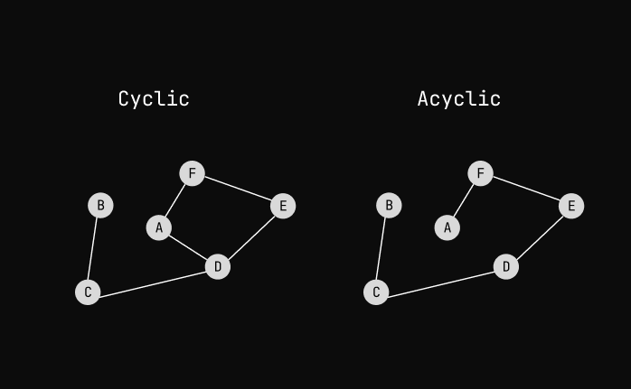

## Algorithms

A word that programmers use when they don't want to explain what they did.

There are tons of algorithms out there and it's impossible to learn all of them.

So In this section, we'll go through the most common algorithms that need to know
to solve Leetcode Problems and Interview Questions.

It's important for programmers to know what algorithm should they use to solve
a given problem in the most efficient way.


### Recursion

Recursion isn't an algorithm but an approach to solving recursive problems.

It is the most difficult concept for beginners to learn. But once you learn it,
it can make solving some problems easy.

#### When to use Recursion

Recursion is mostly used when you can divide a problem into smaller repetive problems.

Like for example if you wrote a function that prints all the files and folders in
a directory and you want to do the same for all the folders inside that directory.

You can just call the same function inside that function for all the folders.

```js
// Pesudo code
function printFilesAndFolders(directory) {
  for (file of filesInDirectory) {
    print(file)
  }

  for (folder of foldersInDirectory) {
    print(folder)
  }

  for (folder of foldersInDirectory) {
    printFilesAndFolders(folder) // Recursion
  }
} 
```

#### Stack Overflow

Recursion can make solving recursive problems straightforward but that have
one caveat.

Whenever a function gets called it gets pushed to Stack and eats some space.
And we have a fixed amount of space in Stack.

If a Recursive function never stops calling itself it'll cause Stack Overflow.
In interpreted languages, you'll get an error saying you've exceeded that maximum call
stack size.

And In compiled languages, your PC will just hang and you may have to restart your computer.

Since they also take space in memory the Space Complexity of a Recursive Function
is O(n) where n is the number of recursive function calls.

So you have to have the Recursive function to stop it at some point.

#### Anatomy of Recursive Function

Every recursive function needs to have something called a Base Case. The Base Case
will stop the recursive function from continuing calling itself.

And where the function call itself is called Recursive Case.


#### Factorial

The most commonly seen function when it comes to Recursion.

In mathematics, Factorial is the product of all positive integers less than or equal to a given positive integer and denoted by that integer and an exclamation point.

For example: 5! = 5 * 4 * 3 * 2 * 1
             n! = n * n-1 * n-2 * n-3 * n-4

We can write this as this: n! = n * (n-1)!

There is a recursion in this equation.

Let's implement this in code:

```js
function factorial(n) {
  return n * factorial(n-1);
}
```

This exatly looks like this equation. But there is one thing missing, the base
case.

We want it to stop when it reaches 1 or the given number is smaller than 1.

Because in Factorial we only deal with positive numbers.

```js
function factorial(n) {
  if (n < 1) { // The base case
    return 1;
  }

  return n * factorial(n-1);
}
```
The space and time complexity of this function is O(n).

#### Fibonacci

The Fibonacci sequence is also famous programming question for recursion.

In Fibonacci sequence each number is the sum of previous two numbers.

`1, 1, 2, 3, 5, 8, 13, 21, ...`

Now the question is how will you find the the nth number in the Fibonacci 
sequence?

You can say the the nth number in the Fibonacci sequence is equal to
n-1th + n-2th number in the Fibonacci sequence.

```
fib(n) = fib(n-1) + fib(n-2)
```

Here is the code:

```js
function fib(n) {
  if (n < 2) { // Base case
    return n;
  }

  return fib(n-1) + fib(n-2);
}
```

The base case will take care of 0 and 1.

What do you think the Big O of this is?

It's actually O(n^2).

Here is why:

The function is calling itself twice so the number of calls doubles as we go down
the numbers.

Here is a visual representation of this function:


As we can see in the graph, we are calculating same values more than once.
This is a really inefficient way to solve this problem.

The normal iterative approach would be the best to solve this problem with
O(n) time compexity and O(1) space complexity.

```js
function fib(n) {
  let num1 = 0;
  let num2 = 1;
    
  for (let i = 1; i <= n && n > 2; i++) {
    let total = num1 + num2;
    num1 = num2;
    num2 = total;
  }

  return num2;
}
```

#### Recursive vs Iterative approach

Anything that can be implemented Iteratively can be
implemented iteratively (loop).

So when to use recursion and when to use iteration?

Use recursion when you don't have to worry about memory.
and the recursive approach is more straightforward.

Use iteration when you have to worry about memory or the
the iterative approach is more efficient than the recursive
approach.


### Backtracking

Backtracking is a technique based on recursion to solve a problem step by step
and if a step is not giving the results it goes back and tries a different step 
until it reaches the solution.

### Solving sudoku using Bracktracking

Given a partially filled 9×9 2D array `grid[9][9]`, the goal is to assign digits
(from 1 to 9) to the empty cells so that every row, column, and subgrid of size 
3×3 contains exactly one instance of the digits from 1 to 9

First we need a helper function that will give us the possible numbers in a cell.

```js
function getValidNumbers(input, x, y) {
  // Storing numbers as array of booleans
  let validNumbers = new Array(10).fill(true);

  // Check row
  for (let xi = 0; xi < input.length; xi++) {
    validNumbers[input[xi][y]] = false;
  }

  // Check column
  for (let yi = 0; yi < input.length; yi++) {
    validNumbers[input[x][yi]] = false;
  }

  // Check 3x3 grid
  let gridX = Math.floor(x/3) * 3;
  let gridY = Math.floor(y/3) * 3;

  for (let xi = gridX; xi < gridX + 3; xi++) {
    for (let yi = gridY; yi < gridY + 3; yi++) {
      validNumbers[input[xi][yi]] = false;
    }
  }

  let result = [];

  for (let i = 0; i < validNumbers.length; i++) {
    if (validNumbers[i]) {
      result.push(i);
    }
  }

  return result;
}
```

Then our main solver function:

```js
function solveSudoku(input) {
  // Loop over every cell
  for(let x = 0; x < input.length; x++) {
    for (let y = 0; y < input.length; y++) {
      if (input[x][y] === 0) {
        // First we need to know what numbers we can put in this cell
        const validNumbers = getValidNumbers(input, x, y);

        // Try with each valid numbers
        for (let validNumber of validNumbers) {
          input[x][y] = validNumber;

          // This will show how this algorithm works step by step
          console.log({x, y, validNumbers, validNumber});
          console.table(input);

          let res = solveSudoku(input) // This will now fill the next empty cell

          if (!res) { // If the result is false then that means we need to go back
            input[x][y] = 0;
            continue;
          } else {
            return res;
          }
        }

        // If we reached here that means we don't have any numbers to put
        // in so we return false to indicate we need to go one step back
        return false;
      }
    }
  }

  // If we reached here that means the board is finised so return the board
  return input;
}
```

You can try running this code with the given input:

```js
const input = [
  [3, 0, 6, 5, 0, 8, 4, 0, 0],
  [5, 2, 0, 0, 0, 0, 0, 0, 0],
  [0, 8, 7, 0, 0, 0, 0, 3, 1],
  [0, 0, 3, 0, 1, 0, 0, 8, 0],
  [9, 0, 0, 8, 6, 3, 0, 0, 5],
  [0, 5, 0, 0, 9, 0, 6, 0, 0],
  [1, 3, 0, 0, 0, 0, 2, 5, 0],
  [0, 0, 0, 0, 0, 0, 0, 7, 4],
  [0, 0, 5, 2, 0, 6, 3, 0, 0]
];
```

It's hard to understand what this is doing just by reading the code so I
suggest you to watch [this video](https://www.youtube.com/watch?v=G_UYXzGuqvM)
to understand it better.

### Permutations

Calculating permutaions of given collection is another great use case of
backtracking algorithm.

```js
const input = [1,2,3]

function permutations(input, results=[], progress=[], used={}) {
  for (let num of input) { // Loop over items
    if (!used[num]) { // If item is not used
      used[num] = true; // Make the item as used
      progress.push(num); // Push the item to our progress
      permutations(input, results, progress, used); // Then move to the next index in our progress
      used[num] = false; // After we are done with the item mark it as not used
      progress.pop(); // And remove the number from progress too so we can add next one
    }
  }

  // One the progress has the same length as the input
  // That's one of our results
  if (progress.length === input.length) {
    results.push([...progress]);
  }
}

let results = [];

permutations(input, results);

console.log(results);
```
Once again it's hard to explain what this is doing in text so I recommed you to
watch [this video](https://www.youtube.com/watch?v=s7AvT7cGdSo).

### Two pointers

Two pointers is really an easy and effective technique that is typically used for searching pairs in an array.

Usually you have one pointer pointing at the left most side of the array and one
pointing at the right most side of the array.

And we move them towards each other.

Like for example if you want to know if a string is a palindrome or not
this technique is the best way to know that.

For example `"madamimadam"` is a valid palindrome.

```js
function isPalindrome(string) {
  let left = 0;
  let right = string.length - 1;

  while (left < right) {
    if (string[left] !== string[right]) {
      return false;
    }
  }

  return true;
}
```

### Divide and Conquer

Divide and Conquer algorithm is a strategy of solving a large problem by recursively dividing the problem into sub-problems and solving them until we get
to the solution.

The best example of this is searching for a item in a sorted list.

```js
const list = [1,3,6,7,9,15,20];
```

If we want to find an item in a sorted array we can start from the middle and
check if the middle one is smaller or greater or equal to the target.

Because the array is sorted we know that the target could be in either the left
side if the middle is bigger or the right side if middle is smaller.

Then go to the next middle (either of left side or right side).

Continue doing this until you reach the target.

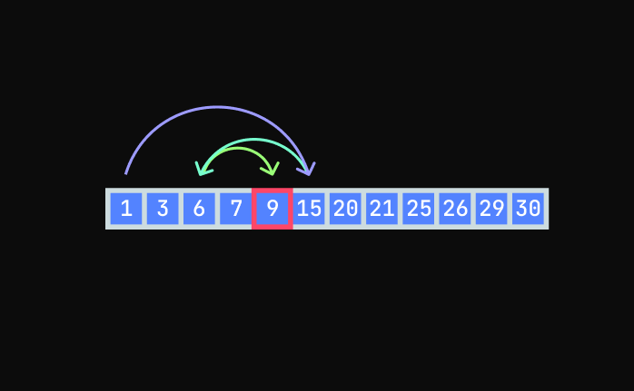

The is called binary search and the Big O of this
is O(log n).

### Sorting

A Sorting Algorithm is used to rearrange a given array or list of elements according 
to a comparison operator on the elements.

There are tons of sorting algorithms and all of them have their pros and cons. So
it's important to learn when to use them.

#### Basic Sorting Alorithms

Bubble Sort, Selection Sort, and Insertion Sort are very basic sorting algorithms.
They are easy to implement but have the worst time complexity so they are only used
to introduce beginners to sorting algorithms.

#### Bubble Sort

Bubble sort is a very basic sorting algorithm. It's usually used as a learning
tool to teach about sorting algorithms instead of using it in a real case.
Because it is very slow.

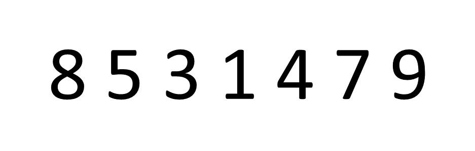

In Bubble sort, you check two elements at a time and swap the values in sorted
order and move forward and repeat.

You need to loop over the same array multiple times until all the values are in sorted order.

This is called bubble sort because we are bubbling the higher values to the right side
and lower values to the left side.

The Time Complexity of this algorithm is O(n*n) or O(n^2).

The code:

```js
function bubbleSort(list) {
  for (let i = 0; i < list.length; i++) {
    for (let j = 0; j < list.length; j++) {
      // If left side is bigger than right side
      if (list[j] > list[j+1]) {
        // Swap
        let temp = list[j];
        list[j] = list[j+1];
        list[j+1] = temp;
      }
    }
  }

  return list;
}
```

#### Selection Sort

Selection sort works but looking for the smallest element in the
list and swapping it with the left-most side in the list.

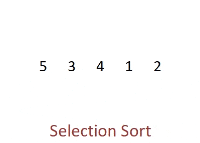

This algorithm also takes O(n^2) time.

The code:

```js
function selectionSort(list) {
  for (let i = 0; i < list.length; i++) {
    let smallest = list[i];
    let smallestIndex = i;
    
    for (let j = i+1; j < list.length; j++) {
      if (list[j] < smallest) {
        smallest = list[j];
        smallestIndex = j
      }  
    }

    // Swap
    let temp = list[i];
    list[i] = smallest;
    list[smallestIndex] = temp;
  }

  return list;
}
```

#### Insertion Sort

Insertion sort is like Bubble sort and Selection sort. Not very fast but there are
cases where it can outperform these two with the time complexity of O(n).

This happens when the list is almost sorted.

And this is how it works:


The code:

```js
function insertionSort(list) {
  for (let i = 0; i < list.length; i++) {
    // If the current number we are looking at is smaller than first element
    // Move the first element to right and place the smaller element
    // in place of first element
    if (list[0] > list[i]) {
      // First remvoe the current element from the list
      const elementWeRemoved = list.splice(i,1)[0]; // [0] to get the element we removed
      // Place it in front of the list
      list.unshift(elementWeRemoved);
    } else {
      // If the element we are looking at is not smaller than first element
      // Then we need to figure out where we should put it but finding the
      // Bigger element from the left side
      for (let j = 1; j < i; j++) {
        if (list[i] >= list[j-1] && list[i] < list[j]) {
          // Remvoe the current element from the list
          const elementWeRemoved = list.splice(i,1)[0];
          // Place it where it belongs
          list.splice(j, 0, elementWeRemoved);
        }
      }

    }
  }
  return list
}
```

The best-case scenario for Insertion sort is a small list or nearly sorted list.
The time complexity for the best case is O(n).

#### Merge Sort

Mergo Sort is a sorting algorithm that use actually use in softwares unlike the previous ones.
And the time complexity of Merge Sort is O(n log n) because this uses Divide anc Conquer method.

In the first stage we divide the list of items into halfs recursively until we have one item.
Then in the second stage we put them back together but in a sorted order.


To implement this we need to write two functions one will divide the list recursively and
the other will merge them in sorted order.

```js
function mergeSort(list) {
  if (list.length === 1) {
    return list;
  }

  const middle = Math.floor(list.length / 2);

  const left = list.splice(0, middle);
  const right = list.splice(middle);

  return merge(
    mergeSort(left),
    mergeSort(right)
  );
}

function merge(left, right) {
  const result = [];
  let leftIndex = 0;
  let rightIndex = 0;

  while (leftIndex < left.length && rightIndex < right.length) {
    if (left[leftIndex] < right[rightIndex]) {
      result.push(left[leftIndex]);
      left++;
    } else {
      result.push(right[rightIndex]);
      right++;
    }
  }

  // Put the remaining elements in the result
  return result.concat(left.slice(leftIndex)).concat(right.slice(rightIndex));
}
```

#### Quick Sort

Quick sort sounds like it's the quickest sorting algorith but it is as fast as merge sort but
uses a different techinique than merge sort.

Explaining Quick sort in text is impossible so I recommend you to watch
[this video](https://www.youtube.com/watch?v=XE4VP_8Y0BU).

#### Which sort to use?

You will never use Bubble sort and Selection sort in a real software. They are only used for
teaching sorting.

Use Insertion sort when you have a small list or an almost sorted list.

Merge Sort whether it's the best case or the worst case will only take O(n log n) time. But
it takes O(n) space.

Quick Sort in the best case takes O(n log n) time and in the worst case takes (n^2) time. But
it takes O(n log n) space.

So use Merge Sort when you are worried about the worst-case and you have plenty of memory.

And use Quick sort when you don't have to worry about the worst-case or have less memory.

#### Heap Sort

Heapsort is basically using the [Heap](#heap-and-binary-heap) data structure to sort an array. The convertion from array to heap
takes O(n log n) time.

This sorting algorithm is only used when we need to get the lowest or highest value in a list.

#### Radix Sort and Counting Sort

Mathematically it's impossible to beat O(n log n) time when it's come to sorting. Because we have
to compare every element with each other.

Radix Sort and Counting Sort beat the O(n log n) time by not comparing elements
with each other.

Both of them take advantage of how data is sorted and they only work with numbers.

#### Counting Sort

We only use this when the range of values (biggest number - smallest number + 1) is smaller or equal to the length
of the input array.

The Big O of this is O(n + k) where n is the length of input and k is the
range of numbers.

For example for this one the n is 7 and the k is 6:

```js
const list = [6,4,6,2,4,7,1]
```

The algorithm of Counting sort goes like this:

Loop through the entire list and keep track of the frequencies of the numbers in a HashSet or an array.
Now loop over the range and check which number was present and how many times and put them new a new array.

The code:

```js
function countingSort(list) {
  const seen = {};
  const res = [];
  let highest = list[0];
  let lowest = list[0];

  for (num of list) {
    if (num > highest) {
      highest = num;
    }

    if (num < lowest) {
      lowest = num;
    }

    if (!(num in seen)) {
      seen[num] = 1;
    } else {
      seen[num]++;
    }
  }

  // This takes O(n) time even through there is a nested loop
  for (let i = lowest; i <= highest; i++) {
    if (i in seen) {
      for (let j = 0; j < seen[i]; j++) {
        res.push(i);
      }
    }
  }

  return res;
}
```

#### Radix Sort

Radix Sort is hard to explain for me so
I recommend you to read [this article](https://www.doabledanny.com/radix-sort-in-javascript).

You can skip this one becuase it's now that important to know.

#### Bucket Sort

This is also not important so
I'll just point to [another article](https://www.programiz.com/dsa/bucket-sort) for this.

### Searching

#### Linear Search

Linear Search is a method of finding a value by checking each item sequentially
in a data structure.

It's the most basic way to search and the time complexity of this is O(n).

One example of this is getting the index of a value in an array. 

```js
function getIndex(list, value) {
  for (let i = 0; i < list.length; i++) {
    if (list[i] === value) {
      return i;
    }
  }

  return -1; // If value not found
}
```

Linear Search is the slowest way to seach for an item so always avoid using this
if we have a large amount of data.

But for a small list this is not a bad method.

### Binary Search

We can use Binary Seach when the data is in sorted order,
it can be an array or a [Binary Tree](#binary-tree).

For example if we have an array `[1,3,6,7,9,15,20,21,25,26,29,30]` and
we want the index of `9` we can first check the middle value.

If the middle value is bigger than our target then go the the middle from
left side.

If the middle from left side is smaller then go to the next middle until you
get to the target.


The code:

```js
function binarySearch(list, value) {
  let begin = 0;
  let end = list.length - 1;

  while (begin <= end) {
    mid = Math.ceil((begin + end)/2);

    if (list[mid] > value) {
      end = mid - 1;
    } else if (list[mid] < value) {
      begin = mid + 1;
    } else {
      return mid;
    }
  }

  return -1;
}
```

The time complexity of Binary Search is O(log n).

### BFS and DFS

If we have a unsorted Tree or a Graph we have go over every item in the data-structure
to find an item.

We have two method for searching in these two data-strucutre:
- Breadth First Search
- Depth First Search

Both have the same time complexity in the worst case. It's O(n).
But they have their pros and cons.

#### Breadth First Search

The way BFS works is we first check the first level (the root node) then
then each element of second level then each element of third level and so on.

It looks like this:

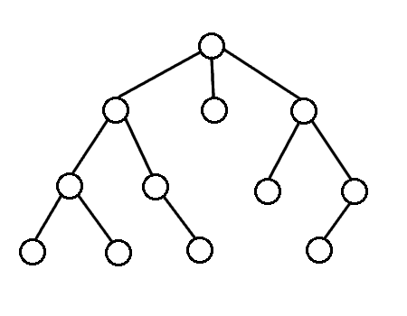

#### Depth First Search

In DFS we explore the depth of the child node first then move to
the next child node.

It looks like this:


#### BFS vs DFS

**Data structure**:

BFS uses Queue to find the shortest path.

DFS uses Stack to find the shortest path.

**Faviourable Condition**:

BFS is better when target is closer to Source.

DFS is better when target is far from source.

**Space Complexity**:

In case of Balanced Binary Trees BFS takes more memory than DFS
because the Big O of BFS is O(w) where w is the width of the tree and
the Big O of DFS is O(h) where h is the height of the tree.

**Pros**:

BFS is good at finding the shortest path from the source.

DFS is used when we want to know if the target exist and it usually takes
less memory.

To learn more about their space and time complexity read [this](https://stackoverflow.com/questions/9844193/what-is-the-time-and-space-complexity-of-a-breadth-first-and-depth-first-tree-tr)

#### When to use what?

**BFS**:

If the target is not far from the source.

If the tree is deep than wide.

Determining the shortest path from the source to the target.

**DFS**:

If the target is far from the source.

If the tree is wide than deep.

Determining if the target exists.

#### Implementing BFS

Assuming the node structure look like this:

```ts
Node {
  value: Number,
  childrens: [Node]
}
```

```js
function breadthFirstSearch(root, target) {
  let currentNodes = [root]; // Store all the nodes of current level

  while (currentNodes.length > 0) { // While we have nodes in current level
    let nextNodes = []; // Store the nodes in next level
    
    for (let node of currentNodes) { // Look in each node at current level
      if (node.value === target) { // If It's the target then return the node
        return node;
      } else { // If it's not the target then push it's childrens to next level
        for (let child of node.childrens) {
          nextNodes.push(child);
        }
      }
    }

    currentNodes = nextNodes; // Move to next level
  }

  return null;
}
```

You can test this code on this tree:

```js
//        5
//      / | \
//     6  7  8
//    /| /\  |\
//   1 2 3 9 4 10 

const testTree = {
  value: 5,
  childrens: [
    {
      value: 6,
      childrens: [
        {
          value: 1,
          childrens: []
        },
        {
          value: 2,
          childrens: []
        }
      ],
    },
    {
      value: 7,
      childrens: [
        {
          value: 3,
          childrens: []
        },
        {
          value: 9,
          childrens: []
        }
      ]
    },
    {
      value: 8,
      childrens: [
        {
          value: 4,
          childrens: []
        },
        {
          value: 10,
          childrens: []
        }
      ]
    }
  ]
}

console.log(breadthFirstSearch(testTree, 3)); // Returns the node with 3 value
console.log(breadthFirstSearch(testTree, 11)); // Returns null
```

We can see how the BFS function traversing through the tree by converting
it to an array.

```js
function breadthFirstTraverse(root) {
  let currentNodes = [root];
  let res = [];

  while (currentNodes.length > 0) {
    let nextNodes = [];

    for (let node of currentNodes) {
      res.push(node.value);

      for (let child of node.childrens) {
        nextNodes.push(child);
      }
    }

    currentNodes = nextNodes;
  }

  return res;
}
```

Try running this code for that test tree you should see this:

```js
[5, 6, 7, 8, 1, 2, 3, 9, 4, 10]
```

#### Implementing DFS

There are three ways to implement BFS. PreOrder, InOrder, and PostOrder.

There are the three ways traverse through the tree and it looks like this:

```js
//         5
//       / | \
//      6  7  8
//     /| |\  |\
//    1 2 3 9 4 10

InOrder = [1,6,2,5,3,7,9,4,8,10]
PreOrder = [5,6,1,2,7,3,9,8,4,10]
PostOrder = [1,2,6,3,9,7,4,10,8,5]
```

**InOrder**:

InOrder is used to get the values of the nodes in non-decreasing order in a [BST](#binary-search-tree).

InOrder is only used in Binary Trees.

So we'll use a Binary Tree Node for this:

```ts
Node {
  value: Number,
  left: Node
  right: Node
}
```

```js
function DFSInOrder(source) {
  if (!source) {
    return [];
  }

  let res = [];

  const left = DFSInOrder(source.left);

  for (let value of left) {
    res.push(value);
  }

  res.push(source.value);

  const right = DFSInOrder(source.right);

  for (let value of right) {
    res.push(value)
  }

  return res;
}
```

Try running it with this Binary Tree.

```js
//         10
//        /  \
//       5   12
//      /\   |\
//     3  7 11 13
//    /| |\
//   1 4 6 8

const testBinaryTree = {
  value: 10,
  left: {
    value: 5,
    left: {
      value: 3,
      left: {
        value: 1,
        left: null,
        right: null
      },
      right: {
        value: 4,
        left: null,
        right: null
      }
    },
    right: {
      value: 7,
      left: {
        value: 6,
        left: null,
        right: null,
      },
      right: {
        value: 8,
        left: null,
        right: null
      }
    }
  },
  right: {
    value: 12,
    left: {
      value: 11,
      left: null,
      right: null
    },
    right: {
      value: 13,
      left: null,
      right: null
    }
  }
}
```

It should give this result:

```js
[1, 3, 4, 5, 6, 7, 8, 10, 11, 12, 13]
```

**PreOrder**:

Used to create a copy of a tree. For example, if you want to create a replica
of a tree, put the nodes in an array with a pre-order traversal.

Then perform an Insert operation on a new tree for each value in the array.
You will end up with a copy of your original tree.

Since we can use any type of tree or graph I'll use a
generic node.

```ts
Node {
  value: Number,
  childrens: [Node]
}
```

```js
function DFSPreOrder(source) {
  if (!source) {
    return [];
  }

  let res = [source.value];

  for (let child of source.childrens) {
    const next = DFSPreOrder(child);

    for (let value of next) {
      res.push(value);
    }
  }

  return res;
}
```

Example Tree:

```js
//        5
//      / | \
//     6  7  8
//    /| /\  |\
//   1 2 3 9 4 10 

const testTree = {
  value: 5,
  childrens: [
    {
      value: 6,
      childrens: [
        {
          value: 1,
          childrens: []
        },
        {
          value: 2,
          childrens: []
        }
      ],
    },
    {
      value: 7,
      childrens: [
        {
          value: 3,
          childrens: []
        },
        {
          value: 9,
          childrens: []
        }
      ]
    },
    {
      value: 8,
      childrens: [
        {
          value: 4,
          childrens: []
        },
        {
          value: 10,
          childrens: []
        }
      ]
    }
  ]
}
```

Result: `[5, 6, 1, 2, 7, 3, 9, 8, 4, 10]`

**PostOrder**:

Used to delete a tree from leaf to root.

```js
function DFSPostOrder(source) {
  if (!source) {
    return [];
  }

  let res = [];

  for (let child of source.childrens) {
    const next = DFSPostOrder(child);

    for (let value of next) {
      res.push(value);
    }
  }

  res.push(source.value);

  return res;
}
```

Run this code with the example tree of previous one
and you should get this result: `[1, 2,  6, 3, 9, 7, 4, 10, 8, 5]`

### Dynamic Programming

Dynamic Programming is a technique that is used when you have
a problem that can be divided into smaller sub-problems and then the
solutions to these subproblems are cached in case the sub-problems repeat.

#### Memoization

Caching or Memoization is a big part of Dynamic Programming.

Memoization is an act of caching the result of a function so that
if the function is computationally expensive and that function will
get called multiple times with the same input it can return the result immediately.

Here is a simple function that takes an input and returns the log 
of the input number.

```js
function getLog(n) {
  return Math.log(n);
}
```

Log is an expensive function but not that much to slow down a modern
computer.

If we want to calculate the log of all numbers in a list and that list is big
and also have lots of duplicates, we can use memoization to speed up the
calculation.

```js
const cache = {};

function getLog(n) {
  if (!cache[n]) {
    cache[n] = Math.log(n);
  }

  return cache[n];
}
```

Now even if one number is used multiple times the calculation will only run
one time.

We can improve this code a little more. Since most people hate using global
variables, we should move this cache variable to a scope.

```js
const getLog = (() => {
  const cache = {};

  return (n) => {
    if (!cache[n]) {
      cache[n] = Math.log(n);
    }

    return cache[n];
  }
})();
```

Using the closure feature of JavaScript now we have the cache variable scoped.
And the function behaves the same.

#### Fibonacci Sequence

Fibonacci Sequence is an ideal example to solve using Dynamic Programming

In a Fibonacci Sequence, every number is equal to the sum of the previous two
numbers

```
0, 1, 1, 2, 3, 5, 8, 13, 21, 34 . . .
```
Now we will take a function fib(n) that returns the nth number of the Fibonacci series. We can come up with a recursive formula for this:

```
fib(n) = fib(n-1) + fib(n-2)
```

As you can see we have divided a problem into two sub-problems. Now let's
write the code for it.

```js
function fib(n) {
  if (n < 2) {
    return n;
  }

  return fib(n-1)+fib(n-2);
}
```

It was so easy to implement but we have one problem here.

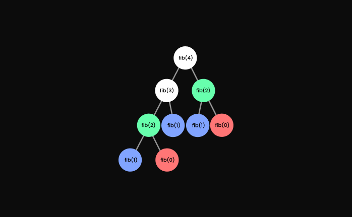

In this visualization, you can see that we are solving some same problems
twice so we need to add memoization to it.

```js
const cache = {}

function fib(n) {
  if (cache[n]) {
    return cache[n];
  }

  let res;

  if (n < 2) {
    res = n;
  } else {
    res = fib(n-1)+fib(n-2)
  }

  cache[n] = res;

  return res;
}
```

Without cache, we were solving some sub-problems twice so the Time Complexity
of that was O(n^2).

With memoization, we are solving every sub-problem once so the Time Complexity
becomes O(n) which is a huge improvement.

## Additional Important Topics

- Sliding Window
- Greedy Alogorithms
- Intervals

## Coding Problems

Start here if new -> [neetcode.io](neetcode.io)

To prepare for interview at top tech -> [Grind75](https://www.techinterviewhandbook.org/grind75)